

<h1>Emoticon-Lab</h1>
  
**-Analysis document-**

| | |
| :--- | :--- |
| **Student No.** | 22212048 |
| **Name** | 김동준 |
| **E-mail** | kdjkdj111@gmail.com |

 

**[ Revision history ]**

| Revision date | Version # | Description | Author |
| :--- | :--- | :--- | :--- |
| 04/29/2026 | 1.0 | First Writing | Kim dong jun |

 
---

## Contents

1. [Introduction](#1-introduction)
2. [Use case analysis](#2-use-case-analysis)
3. [Domain analysis](#3-domain-analysis)
4. [User Interface prototype](#4-user-interface-prototype)
5. [Glossary](#5-glossary)
6. [References](#6-references)

---

## 1. Introduction

우리의 일상 속에서 이모티콘은 뗄래야 뗄 수 없는 핵심 대화 수단이 되었습니다. 이러한 트렌드에 맞춰 이모티콘 제작을 꿈꾸는 예비 작가들이 많아졌으나, 그림 실력과 별개로 까다로운 승인 조건과 기술적 장벽으로 인해 결국 포기하는 사람들이 대다수입니다.

Emoticon-Lab에서는 제작된 이모티콘을 기술적인 부분과 구성적인 부분으로 나누어 정밀하게 분석함과 동시에, 실제 플랫폼의 검수 사항에 맞춰 명확한 가이드라인을 제공합니다. 이는 창작자들의 진입 장벽을 낮추는 데 유용하며, 추후에는 이모티콘 기획 및 컨설팅 서비스까지의 확장성까지 기대할 수 있습니다.

본 문서에서는 이모티콘 분석 시스템을 사용할 타겟 유저들의 요구 사항과 시스템 제공 기능에 맞춰 Use case 및 Domain을 분석하고 User Interface를 프로토타입으로 구성하여 제시합니다.

---

## 2. Use case analysis

### 1) Use case diagram
본 다이어그램은 Emoticon-Lab 시스템을 이용하는 주체(Actor)들과 시스템이 제공하는 핵심 기능(Use Case) 간의 상호작용을 구조화한 도식입니다.

**Actors**
* **사용자**: 이모티콘을 업로드하고 검수 및 시뮬레이션 기능을 직접 이용하는 서비스의 핵심 주체입니다.
* **외부 AI server**: 시스템으로부터 이미지 데이터를 전달받아 AI 분석 결과를 반환하는 외부 연동 시스템입니다.

### 2) Use case description

#### Use Case #1: Sign up
| GENERAL CHARACTERISTICS | 내용 |
| :--- | :--- |
| **Summary** | 사용자가 시스템을 사용하기 위해 회원 등록할 때 사용하는 기능 |
| **Scope** | Emoticon-Lab |
| **Level** | User level |
| **Author** | Kim dong jun |
| **Last Update** | 2026.05.03 |
| **Status** | Analysis |
| **Primary Actor** | User |
| **Preconditions** | Emoticon-Lab 시스템에 접속되어 있어야 한다. |
| **Trigger** | 로그인 화면에서 Sign up 버튼을 눌렀을 때 |
| **Success Post Condition** | 시스템에 고객 정보를 등록한다. |
| **Failed Post Condition** | 시스템에 고객 정보가 등록되지 않는다. |

| MAIN SUCCESS SCENARIO | |
| :--- | :--- |
| **Step** | **Action** |
| S | 사용자가 Emoticon-Lab에 회원가입을 한다. |
| 1 | 이 Use case는 사용자가 회원가입할 때 시작된다. |
| 2 | 사용자가 회원가입 버튼을 누른다. |
| 3 | 시스템은 회원가입 페이지를 띄운다. |
| 4 | 사용자가 회원 정보를 입력하고 등록 버튼을 누른다. |
| 5 | 시스템은 정보에 이상이 없는지 판단하고, 성공 여부를 결정한다. |
| 6 | 이 Use case는 회원가입이 성공하면 끝난다. |

| EXTENSION SCENARIOS | |
| :--- | :--- |
| **Step** | **Branching Action** |
| 5 | 5a. 입력 정보 문제로 회원가입에 실패한다.  5a1. 회원 가입 실패 메시지를 보여준다.  5a2. 회원정보 입력 단계로 돌아간다. (Use case #1-3) |

| RELATED INFORMATION | |
| :--- | :--- |
| **Performance** | < 1 seconds |
| **Frequency** | 사용자당 하루 평균 1번 |
| **Concurrency** | No Limits |
| **Due Date** | 2026.05.25 |

 

#### Use Case #2: Login
| GENERAL CHARACTERISTICS | 내용 |
| :--- | :--- |
| **Summary** | 사용자가 시스템 사용을 위해 회원인증을 받기 위한 기능 |
| **Scope** | Emoticon-Lab |
| **Level** | User level |
| **Author** | Kim dong jun |
| **Last Update** | 2026.05.03 |
| **Status** | Analysis |
| **Primary Actor** | User |
| **Preconditions** | 시스템에 회원 등록이 완료된 상태여야 한다. |
| **Trigger** | 메인 화면에서 로그인 버튼을 눌렀을 때 |
| **Success Post Condition** | 사용자 세션이 생성되고 업로드 화면으로 이동한다. |
| **Failed Post Condition** | 로그인 실패 메시지를 출력하고 로그인 페이지를 유지한다. |

| MAIN SUCCESS SCENARIO | |
| :--- | :--- |
| **Step** | **Action** |
| S | 사용자가 시스템에 로그인하여 권한을 얻는다. |
| 1 | 이 Use case는 사용자가 로그인할 때 시작된다. |
| 2 | 사용자가 ID와 Password를 입력하고 로그인 버튼을 누른다. |
| 3 | 시스템은 DB에서 계정 정보를 조회하여 일치 여부를 판단하고, 성공 여부를 결정한다. |
| 4 | 이 Use case는 로그인이 성공하면 끝난다. |

| EXTENSION SCENARIOS | |
| :--- | :--- |
| **Step** | **Branching Action** |
| 3 | 3a. 아이디나 비밀번호가 일치하지 않으면 로그인에 실패한다.  3a1. 로그인 실패 메시지를 보여준다.  3a2. 로그인 정보 입력 단계로 돌아간다. (Use case #2-2) |

| RELATED INFORMATION | |
| :--- | :--- |
| **Performance** | < 1 seconds |
| **Frequency** | 사용자당 하루 평균 1번 |
| **Concurrency** | No Limits |
| **Due Date** | 2026.05.25 |

 

#### Use Case #3: Logout
| GENERAL CHARACTERISTICS | 내용 |
| :--- | :--- |
| **Summary** | 사용자가 시스템 이용을 마치고 보안을 위해 현재 인증 세션을 종료하는 기능 |
| **Scope** | Emoticon-Lab |
| **Level** | User level |
| **Author** | Kim dong jun |
| **Last Update** | 2026.05.03 |
| **Status** | Analysis |
| **Primary Actor** | User |
| **Preconditions** | 시스템에 로그인되어 세션이 활성화된 상태여야 한다. |
| **Trigger** | 네비게이션 바에서 '로그아웃' 버튼을 눌렀을 때 |
| **Success Post Condition** | 사용자 세션이 초기화되고, 메인 화면으로 이동한다. |
| **Failed Post Condition** | 세션 종료 처리에 오류가 발생할 경우, 로그인 상태를 유지하며 에러 메시지를 출력한다. |

| MAIN SUCCESS SCENARIO | |
| :--- | :--- |
| **Step** | **Action** |
| S | 사용자가 시스템 이용 권한을 안전하게 반납하고 세션을 종료한다. |
| 1 | 이 Use case는 사용자가 로그아웃 버튼을 클릭할 때 시작된다. |
| 2 | 시스템은 현재 세션을 파기한다. |
| 3 | 시스템은 사용자에게 로그아웃 완료 메시지를 보여주고 메인 화면으로 이동시킨다. |
| 4 | 이 Use case는 세션이 안전하게 종료되면 끝난다. |

| EXTENSION SCENARIOS | |
| :--- | :--- |
| **Step** | **Branching Action** |
| 1 | 1a. 사용자가 로그아웃 확인 팝업에서 '취소'를 선택한다.  1a1. 로그아웃 요청을 철회하고 현재 머물고 있던 페이지 상태를 유지한다. |

| RELATED INFORMATION | |
| :--- | :--- |
| **Performance** | < 0.5 seconds |
| **Frequency** | 사용자당 하루 평균 1번 |
| **Concurrency** | No Limits |
| **Due Date** | 2026.05.25 |

 

#### Use Case #4: Upload Image Set
| GENERAL CHARACTERISTICS | 내용 |
| :--- | :--- |
| **Summary** | 검수할 이모티콘 32종의 이미지를 등록하여 프로젝트를 생성하는 기능 |
| **Scope** | Emoticon-Lab |
| **Level** | User level |
| **Author** | Kim dong jun |
| **Last Update** | 2026.05.03 |
| **Status** | Analysis |
| **Primary Actor** | User |
| **Preconditions** | Emoticon-Lab 시스템에 로그인하여 인증된 상태여야 한다. |
| **Trigger** | 대시보드에서 '새 프로젝트 시작' 버튼을 눌렀을 때 |
| **Success Post Condition** | 32장의 이미지가 웹에 저장되고, 그리드 형태로 렌더링된다. |
| **Failed Post Condition** | 업로드 실패 메시지를 출력하며, 업로드 화면을 유지한다. |

| MAIN SUCCESS SCENARIO | |
| :--- | :--- |
| **Step** | **Action** |
| S | 사용자가 검수할 이모티콘 세트를 시스템에 등록한다. |
| 1 | 이 Use case는 회원이 업로드 화면에 들어올 시 시작된다. |
| 2 | 회원은 파일 탐색기를 통해 준비된 32개의 이미지(.png)를 일괄 선택하고 등록한다. |
| 3 | 시스템은 로드된 이미지들의 확장자 및 규격을 검사하고, 이상이 없는 파일들을 서버 DB에 안전하게 저장한다. |
| 4 | 시스템은 업로드된 순서대로 이미지를 Grid UI에 매핑하고 화면에 출력한다. |
| 5 | 이 Use case는 이미지가 성공적으로 업로드 될 시 종료된다. |

| EXTENSION SCENARIOS | |
| :--- | :--- |
| **Step** | **Branching Action** |
| 3 | 3a. 파일이 PNG 형식이 아닐 시 등록에 실패한다.  3a1. 해당 이미지의 그리드에 경고 표시를 한다. |
| 4 | 4a. 사용자가 특정 이미지의 수정을 원할 시  4a1. 수정 이미지 재업로드 Use case (Use case #4) |

| RELATED INFORMATION | |
| :--- | :--- |
| **Performance** | < 1 seconds |
| **Frequency** | 사용자당 하루 평균 1번 |
| **Concurrency** | No Limits |
| **Due Date** | 2026.05.26 |

 

#### Use Case #5: Re-upload Modified Image
| GENERAL CHARACTERISTICS | 내용 |
| :--- | :--- |
| **Summary** | 이미지 세트 중 검수 결과 오류가 발생하거나 수정이 필요한 특정 이미지만 개별적으로 교체하는 기능 |
| **Scope** | Emoticon-Lab |
| **Level** | User level |
| **Author** | Kim dong jun |
| **Last Update** | 2026.05.03 |
| **Status** | Analysis |
| **Primary Actor** | User |
| **Preconditions** | 이미지 세트 업로드(Use case #3)를 통해 최소 하나 이상의 이미지가 업로드 된 상태여야 한다. |
| **Trigger** | 이미지 그리드 또는 기술 분석 상세 리포트 화면에서 특정 이미지의 교체 버튼을 눌렀을 때 |
| **Success Post Condition** | 선택한 특정 이미지 파일만 새로운 이미지로 교체되며, 그리드가 갱신된다. |
| **Failed Post Condition** | 파일 교체가 실패하며, 기존의 이미지가 그대로 유지된다. |

| MAIN SUCCESS SCENARIO | |
| :--- | :--- |
| **Step** | **Action** |
| S | 사용자가 특정 이미지만 수정하여 재등록한다. |
| 1 | 이 Use case는 사용자가 이미지 교체할 시 시작된다. |
| 2 | 사용자가 그리드에서 수정이 필요한 이미지를 선택하고 파일 선택기에서 교체 이미지를 선택한다. |
| 3 | 시스템은 기존에 업로드되었던 이미지의 메타 데이터를 유지한 채 새로운 이미지로 덮어쓴다. |
| 4 | 시스템은 그리드 이미지를 갱신하여 보여준다. |
| 5 | 이 Use case는 이미지 재등록이 성공하면 끝난다. |

| EXTENSION SCENARIOS | |
| :--- | :--- |
| **Step** | **Branching Action** |
| 3 | 3a. 새로 선택한 파일의 규격에 맞지 않을 시 실패한다.  3a1. 파일 교체 실패 메세지를 출력하고 교체 과정을 중단한다. |

| RELATED INFORMATION | |
| :--- | :--- |
| **Performance** | < 1 seconds |
| **Frequency** | 업로드 후, 기술 검수, AI 분석 후 오류 발견 시 발생 |
| **Concurrency** | No Limits |
| **Due Date** | 2026.05.26 |

 

#### Use Case #6: Request Technical Analysis
| GENERAL CHARACTERISTICS | 내용 |
| :--- | :--- |
| **Summary** | 알고리즘을 통해 이미지의 해상도, 여백, 스트레이 픽셀 등을 자동 검수하는 기능 |
| **Scope** | Emoticon-Lab |
| **Level** | User level |
| **Author** | Kim dong jun |
| **Last Update** | 2026.05.03 |
| **Status** | Analysis |
| **Primary Actor** | User |
| **Preconditions** | 32종의 이미지 세트 업로드가 전부 완료된 상태여야 한다. |
| **Trigger** | 기술 검수 화면에서 검수 시작 버튼을 눌렀을 때 |
| **Success Post Condition** | 기술적 에러 데이터가 저장되고 결과 리포트를 출력한다. |
| **Failed Post Condition** | 분석 도중 오류가 발생하면 안내 메시지를 출력하고 이전 상태를 유지한다. |

| MAIN SUCCESS SCENARIO | |
| :--- | :--- |
| **Step** | **Action** |
| S | 사용자가 등록된 이미지의 기술적 규격 및 노이즈 발생 여부를 확인한다. |
| 1 | 이 Use case는 사용자가 기술 검수를 원할 시 시작된다. |
| 2 | 사용자가 '기술 검수' 버튼을 누른다. |
| 3 | 시스템은 이미지 데이터를 분석 API로 전송한다. |
| 4 | 검수 알고리즘이 각 이미지의 픽셀 데이터를 스캔하여 투명도, 여백, 스트레이 픽셀 등을 계산한다. |
| 5 | 서버는 최종 분석 결과를 데이터베이스에 기록하고 웹으로 전송한다. |
| 6 | 시스템은 분석 완료 후 상세 리포트 열람 창을 호출한다. |
| 7 | 이 Use case는 기술 검수가 성공하면 끝난다. |

| EXTENSION SCENARIOS | |
| :--- | :--- |
| **Step** | **Branching Action** |
| 3 | 3a. 인터넷 연결이 안되어있을 시 전송에 실패한다.  3a1. 네트워크 오류 메시지를 출력한다. |
| 4 | 4a. 이미지 데이터 로딩 중 메모리 오류가 발생한다.  4a1. 데이터 처리 오류 메시지 출력하고 검수를 중단한다.  4b. 분석도중 서버와의 네트워크 오류가 발생한다.  4b1. 분석 중단 메시지를 출력하고 검수를 중단한다. |

| RELATED INFORMATION | |
| :--- | :--- |
| **Performance** | < 5 seconds |
| **Frequency** | 이미지 수정 시마다 수행 |
| **Concurrency** | No Limits |
| **Due Date** | 2026.05.28 |

 

#### Use Case #7: Request AI Analysis
| GENERAL CHARACTERISTICS | 내용 |
| :--- | :--- |
| **Summary** | 외부 AI 서버와의 연동을 통해 이모티콘 세트 전체의 감정 키워드를 추출하고 컨셉 일관성을 정밀 분석하는 기능 |
| **Scope** | Emoticon-Lab |
| **Level** | User level |
| **Author** | Kim dong jun |
| **Last Update** | 2026.05.03 |
| **Status** | Analysis |
| **Primary Actor** | User |
| **Secondary Actor** | 외부 Al server |
| **Preconditions** | 32종의 이미지 세트 업로드가 전부 완료된 상태여야 한다. |
| **Trigger** | AI 분석 화면에서 'AI 분석 시작' 버튼을 눌렀을 때 |
| **Success Post Condition** | AI 분석 결과 데이터가 저장되고 결과 리포트를 출력한다. |
| **Failed Post Condition** | 분석 도중 오류가 발생하면 안내 메시지를 출력하고 이전 상태를 유지한다. |

| MAIN SUCCESS SCENARIO | |
| :--- | :--- |
| **Step** | **Action** |
| S | 사용자가 등록된 이미지 세트의 감정 및 컨셉 통일성에 대한 AI 피드백을 확인한다. |
| 1 | 이 Use case는 사용자가 AI 정밀 분석을 원할 시 시작된다. |
| 2 | 사용자가 타겟 연령층, 이모티콘 타입, 캐릭터 설명을 입력한 후 'AI 분석 시작' 버튼을 누른다. |
| 3 | 시스템은 이미지 데이터와 분석 프롬프트를 외부 AI 분석 API로 전송한다. |
| 4 | 외부 AI 서버는 이미지를 분석하여 감정 키워드, 컨셉 일치도 점수 등을 계산하여 반환한다. |
| 5 | 서버는 수신된 분석 결과를 데이터베이스에 기록하고 웹으로 전송한다. |
| 6 | 시스템은 분석 완료 후 상세 리포트 열람 창을 호출한다. |
| 7 | 이 Use case는 AI 분석이 성공적으로 완료되면 끝난다. |

| EXTENSION SCENARIOS | |
| :--- | :--- |
| **Step** | **Branching Action** |
| 3 | 3a. 외부 AI 서버의 응답 지연 혹은 네트워크 타임아웃 발생 시 실패한다.  3a1. 서버 연결 실패 메시지를 출력하고 분석을 중단한다. |
| 4 | 4a. 해당 유저의 일일 API 사용할당을 초과했을 시 실패한다.  4a1. 할당량 초과 안내 메시지를 출력하고 분석 요청을 거부한다. |

| RELATED INFORMATION | |
| :--- | :--- |
| **Performance** | < 10 seconds |
| **Frequency** | 최종 검토 및 이미지 수정시마다 수행 |
| **Concurrency** | No Limits |
| **Due Date** | 2026.05.30 |

 

#### Use Case #8: View Detailed Technical Report
| GENERAL CHARACTERISTICS | 내용 |
| :--- | :--- |
| **Summary** | 기술적 분석을 통해 도출된 에러 데이터(해상도, 여백, 스트레이 픽셀 등)를 시각화하여 확인하는 기능 |
| **Scope** | Emoticon-Lab |
| **Level** | User level |
| **Author** | Kim dong jun |
| **Last Update** | 2026.05.03 |
| **Status** | Analysis |
| **Primary Actor** | User |
| **Preconditions** | 기술적 분석(UC #6)이 최소 1회 이상 완료되어 결과 데이터가 존재해야 한다. |
| **Trigger** | 기술 분석 완료 후 자동으로 호출되거나, 작업 화면에서 '기술 분석 탭'을 눌렀을 때 |
| **Success Post Condition** | 기술 오류 데이터가 시각화된 기술 리포트 화면이 출력된다. |
| **Failed Post Condition** | 데이터를 불러오지 못할 경우 에러 메시지를 출력하고 이전 화면을 유지한다. |

| MAIN SUCCESS SCENARIO | |
| :--- | :--- |
| **Step** | **Action** |
| S | 사용자가 기술 검수 결과를 바탕으로 이모티콘의 규격 및 픽셀 오류 상태를 상세히 파악한다. |
| 1 | 이 Use case는 기술 분석 프로세스가 성공적으로 종료되거나 사용자가 기술 리포트 탭을 클릭할 때 시작된다. |
| 2 | 시스템은 해당 작업 세션의 기술적 에러(해상도, 스트레이 픽셀 좌표 등) 데이터를 DB에서 호출한다. |
| 3 | 시스템은 호출된 데이터를 에러 리스트 및 이미지 내 오류 좌표 표시 등의 형태로 시각화하여 화면에 구성한다. |
| 4 | 사용자는 이모티콘별 상세 기술 오류를 시각적으로 확인한다. |
| 5 | 이 Use case는 사용자가 리포트 창을 닫거나 다른 탭(또는 메뉴)으로 이동하면 끝난다. |

| EXTENSION SCENARIOS | |
| :--- | :--- |
| **Step** | **Branching Action** |
| 2 | 2a. 서버 응답 문제로 인해 분석 데이터를 불러오는 데 실패한다.  2a1. 데이터 로드 실패 메시지를 출력하고 작업 화면으로 돌아간다. |

| RELATED INFORMATION | |
| :--- | :--- |
| **Performance** | < 1 seconds |
| **Frequency** | 기술 분석 완료 또는 탭 전환 시마다 발생 |
| **Concurrency** | No Limits |
| **Due Date** | 2026.05.30 |

 

#### Use Case #9: View Detailed AI Report
| GENERAL CHARACTERISTICS | 내용 |
| :--- | :--- |
| **Summary** | 외부 AI 분석을 통해 생성된 이모티콘 세트의 감정 키워드 분포 및 컨셉 일관성을 시각화(차트, 텍스트)하여 확인하는 기능 |
| **Scope** | Emoticon-Lab |
| **Level** | User level |
| **Author** | Kim dong jun |
| **Last Update** | 2026.05.03 |
| **Status** | Analysis |
| **Primary Actor** | User |
| **Preconditions** | AI 분석(UC #7)이 최소 1회 이상 완료되어 결과 데이터가 존재해야 한다. |
| **Trigger** | AI 분석 완료 후 자동으로 호출되거나, 작업 화면에서 'AI 분석 탭'을 눌렀을 때 |
| **Success Post Condition** | AI 분석 데이터가 시각화된 AI 리포트 화면(AiView)이 출력된다. |
| **Failed Post Condition** | 데이터를 불러오지 못할 경우 에러 메시지를 출력하고 이전 화면을 유지한다. |

| MAIN SUCCESS SCENARIO | |
| :--- | :--- |
| **Step** | **Action** |
| S | 사용자가 AI 분석 결과를 바탕으로 이모티콘 세트 전체의 컨셉 일관성과 개선 방향을 파악한다. |
| 1 | 이 Use case는 AI 분석 프로세스가 성공적으로 종료되거나 사용자가 AI 리포트 탭을 클릭할 때 시작된다. |
| 2 | 시스템은 해당 작업 세션의 AI 분석 키워드 및 컨셉 평가 점수 데이터를 DB에서 호출한다. |
| 3 | 시스템은 호출된 데이터를 그래프, 차트, 텍스트 피드백 형태로 시각화하여 화면에 구성한다. |
| 4 | 사용자는 세트 전체의 감정 분포 차트와 상세 피드백을 확인한다. |
| 5 | 이 Use case는 사용자가 리포트 창을 닫거나 다른 탭(또는 메뉴)으로 이동하면 끝난다. |

| EXTENSION SCENARIOS | |
| :--- | :--- |
| **Step** | **Branching Action** |
| 2 | 2a. 서버 응답 문제로 인해 분석 데이터를 불러오는 데 실패한다.  2a1. 데이터 로드 실패 메시지를 출력하고 작업 화면으로 돌아간다. |

| RELATED INFORMATION | |
| :--- | :--- |
| **Performance** | < 1 seconds |
| **Frequency** | AI 분석 완료 또는 탭 전환 시마다 발생 |
| **Concurrency** | No Limits |
| **Due Date** | 2026.05.30 |

 

#### Use Case #10: View Personal Dashboard
| GENERAL CHARACTERISTICS | 내용 |
| :--- | :--- |
| **Summary** | 사용자가 본인의 과거 프로젝트 작업 이력 및 저장된 분석 리포트 목록을 한눈에 확인하고 관리하는 기능 |
| **Scope** | Emoticon-Lab |
| **Level** | User level |
| **Author** | Kim dong jun |
| **Last Update** | 2026.05.03 |
| **Status** | Analysis |
| **Primary Actor** | User |
| **Preconditions** | Emoticon-Lab 시스템에 로그인하여 사용자 인증이 된 상태여야 한다. |
| **Trigger** | 로그인에 성공하여 초기 화면으로 이동하거나, 워크 스페이스를 이탈했을 때 |
| **Success Post Condition** | 사용자의 프로젝트 히스토리가 화면에 출력되며, 각 항목의 요약 정보를 확인할 수 있는 상태가 된다. |
| **Failed Post Condition** | 대시보드 데이터 로딩에 실패하며, 시스템은 로드 실패 에러 메시지를 표시한다. |

| MAIN SUCCESS SCENARIO | |
| :--- | :--- |
| **Step** | **Action** |
| S | 사용자가 과거 작업 기록을 조회하여 이전 리포트를 다시 확인한다. |
| 1 | 이 Use case는 사용자가 로그인 직후나 워크 스페이스에서 이탈했을 시 시작된다. |
| 2 | 사용자가 대시보드 화면에 진입한다. |
| 3 | 시스템은 로그인된 사용자의 ID를 식별하여 데이터베이스(DB)에서 해당 사용자의 프로젝트 데이터를 요청한다. |
| 4 | 시스템은 프로젝트명, 분석 일시, 최종 검수 결과 등의 요약 데이터를 리스트 형태로 렌더링한다. |
| 5 | 이 Use case는 사용자가 대시보드 확인을 마치고 다른 메뉴로 이동하면 끝난다. |

| EXTENSION SCENARIOS | |
| :--- | :--- |
| **Step** | **Branching Action** |
| 3 | 3a. 해당 사용자가 생성한 프로젝트 내역이 DB에 존재하지 않는다.  3a1. "내역이 없습니다" 메시지를 출력한다. |
| 4 | 4a. DB 연결 오류로 인해 데이터를 화면에 표시할 수 없다.  4a1. "데이터를 불러오는 중 오류가 발생했습니다" 메시지를 출력하고 재시도를 유도한다. |

| RELATED INFORMATION | |
| :--- | :--- |
| **Performance** | < 2 seconds |
| **Frequency** | 사용자당 하루 평균 4번 |
| **Concurrency** | No Limits |
| **Due Date** | 2026.05.31 |

 

#### Use Case #11: Simulate Emoticon on Chat ui
| GENERAL CHARACTERISTICS | 내용 |
| :--- | :--- |
| **Summary** | 실제 메신저 환경과 유사한 채팅창 UI에 제작한 이모티콘을 대입하여 가독성과 컨셉을 시각적으로 확인하는 기능 |
| **Scope** | Emoticon-Lab |
| **Level** | User level |
| **Author** | Kim dong jun |
| **Last Update** | 2026.05.03 |
| **Status** | Analysis |
| **Primary Actor** | User |
| **Preconditions** | 이모티콘 이미지 세트가 시스템 내부 메모리에 로드되어 있어야 한다. |
| **Trigger** | 이미지 업로드 완료 후 워크스페이스에 진입할 때 또는 네비게이션 바에서 채팅 UI 시뮬레이션 버튼을 눌렀을 때 |
| **Success Post Condition** | 선택한 이모티콘이 포함된 가장 채팅 화면이 출력되고 테마 변경이 실시간으로 적용된다. |
| **Failed Post Condition** | 채팅 시뮬레이션 UI가 활성화되지 않으며, 시스템은 이전의 이미지 편집 화면 상태를 유지한다. |

| MAIN SUCCESS SCENARIO | |
| :--- | :--- |
| **Step** | **Action** |
| S | 사용자가 제작한 이모티콘이 실제 채팅 환경에서 어떻게 보일지 가독성을 점검한다. |
| 1 | 이 Use case는 사용자가 채팅 환경에서의 시각적 확인을 원할 시 시작된다. |
| 2 | 사용자가 '채팅 UI 시뮬레이션'버튼을 누른다. |
| 3 | 시스템은 가상 메신저 대화창 형태의 UI 레이아웃을 화면에 띄운다. |
| 4 | 사용자가 업로드된 이미지 그리드에서 특정 이모티콘을 선택한다. |
| 5 | 시스템은 선택된 이미지를 채팅 말풍선 내에 배치하여 실시간으로 렌더링한다. |
| 6 | 사용자는 배경 테마를 변경하며 배경색에 따른 가독성을 최종 확인한다. |
| 7 | 이 Use case는 사용자가 시뮬레이션 창을 닫으면 끝난다. |

| EXTENSION SCENARIOS | |
| :--- | :--- |
| **Step** | **Branching Action** |
| 4 | 4a. 이미지파일이 손상되었거나 로딩되지 않은 상태이다.  4a1. 해당 이미지에 에러 아이콘을 표시한다. |

| RELATED INFORMATION | |
| :--- | :--- |
| **Performance** | < 1 seconds |
| **Frequency** | 사용자당 하루 평균 1번 |
| **Concurrency** | No Limits |
| **Due Date** | 2026.05.31 |

 

#### Use Case #12: Reset Current Workspace
| GENERAL CHARACTERISTICS | 내용 |
| :--- | :--- |
| **Summary** | 현재 진행 중인 세션을 초기화하여 새로운 작업을 준비하는 기능 |
| **Scope** | Emoticon-Lab |
| **Level** | User level |
| **Author** | Kim dong jun |
| **Last Update** | 2026.05.03 |
| **Status** | Analysis |
| **Primary Actor** | User |
| **Preconditions** | 작업 영역에 이미지가 로드되어 있거나 분석 세션이 진행중이어야 한다. |
| **Trigger** | 사용자가 작업 중 데이터가 꼬였거나, 현재 작업을 취소하고 새로운 세트를 처음부터 업로드하고 싶을 때 |
| **Success Post Condition** | 메모리를 비우고 새 프로젝트를 생성할 수 있는 쾌적한 새작업 환경을 제공한다. |
| **Failed Post Condition** | 초기화 프로세스가 중단될 경우, 기존의 로드된 데이터와 검수 상태를 그대로 유지한다. |

| MAIN SUCCESS SCENARIO | |
| :--- | :--- |
| **Step** | **Action** |
| S | 사용자가 현재 세션을 종료하고 새 프로젝트 업로드를 준비한다. |
| 1 | 이 Use case는 사용자가 '초기화' 버튼을 누를 때 시작된다. |
| 2 | 시스템은 현재 세션에 로드된 이미지와 검수 데이터를 삭제한다. |
| 3 | 시스템은 화면을 초기 빈 화면으로 되돌리고 초기화 메시지를 출력한다. |
| 4 | 이 Use case는 작업 환경이 성공적으로 재설정되면 끝난다. |

| EXTENSION SCENARIOS | |
| :--- | :--- |
| **Step** | **Branching Action** |
| 1 | 1a. 사용자가 초기화 확인 팝업에서 취소를 선택한다.  1a1. 초기화 명령을 취소하고 기존 작업 상태를 유지한다. |

| RELATED INFORMATION | |
| :--- | :--- |
| **Performance** | < 0.5 seconds |
| **Frequency** | 사용자당 하루 평균 2번 |
| **Concurrency** | No Limits |
| **Due Date** | 2026.06.01 |

---

## 3. Domain analysis

| 구분 | 클래스명 | 설명 |
| :--- | :--- | :--- |
| **1. Entity Class** | 1) User | 사용자의 정보와 계정 상태를 관리하는 클래스이다. (ex: id, password, token usage...) |
| | 2) Project | 작업 세션 정보를 저장하는 클래스이다. (ex: Project id, user id, status, date) |
| | 3) EmoticonImage | 이미지 파일의 메타데이터를 보관하는 클래스이다. (ex: image id, project id, user id, type ...) |
| | 4) TechnicalReport | 기술 검수 결과 데이터를 보관하는 클래스이다. (ex: report id, project id, stray pixel count, margin error list) |
| | 5) AIReport | AI 분석 결과 데이터를 보관하는 클래스이다. (ex: report id, emotion keywords, consistency score, feedback text) |
| | 6) Pixel | 검출된 개별 에러 픽셀의 상세 좌표 정보를 보관하는 클래스이다. (ex: pixel id, coordinates) |
| **2. Control class** | 7) AuthService | 사용자의 로그인, 회원가입 등 인증 로직을 전담하는 클래스이다. (ex: login(), join(), logout()) |
| | 8) WorkspaceService | 프로젝트 생성, 삭제 및 대시보드 조회 등 워크스페이스의 전반적인 작업 흐름을 제어하는 클래스이다. (ex: createProject(), loadDashboard(), resetWorkspace()) |
| | 9) FileService | 이미지 파일 업로드, 스토리지 저장 및 메타데이터 변환을 처리하는 클래스이다. (ex: uploadImages(), getImagePath()) |
| | 10) TechnicalAnalysis | 이미지 처리 알고리즘을 통해 스트레이 픽셀, 해상도, 여백 규격 등을 정밀 검수하는 클래스이다. (ex: scanPixels(), detectErrors(), generateTechReport()) |
| | 11) AlAnalysis | 외부 AI를 통해 디자인 일관성 점수, 감정 키워드, 개선 피드백을 도출하는 클래스이다. (ex: requestAIAnalysis(), calculate Consistency(), generateAIReport()) |

---

## 4. User Interface prototype

* **1) StartView**:  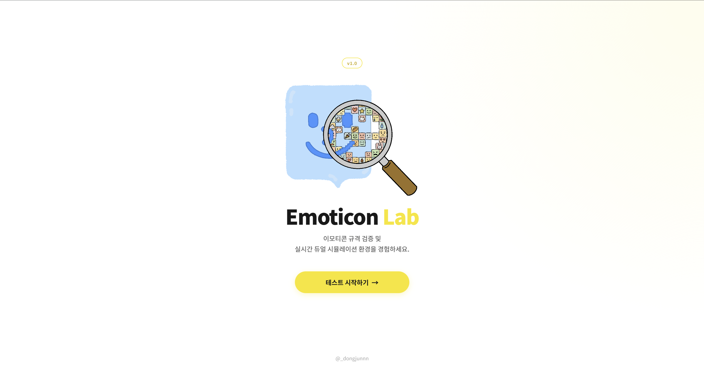 : 첫 시작화면이다. 테스트 시작하기를 누르면 로그인 화면으로 넘어간다.  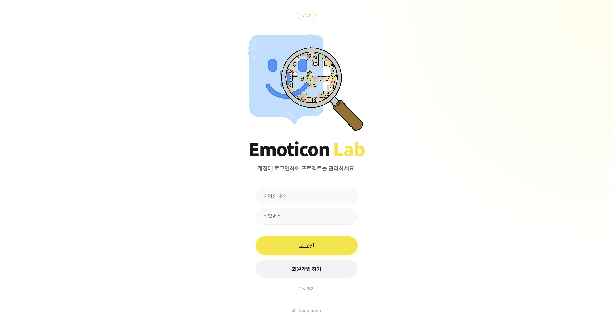 : 로그인 화면이다. ID와 비밀번호를 입력하고 로그인할 수 있으며 계정이 없을 시 회원가입을 진행한다.  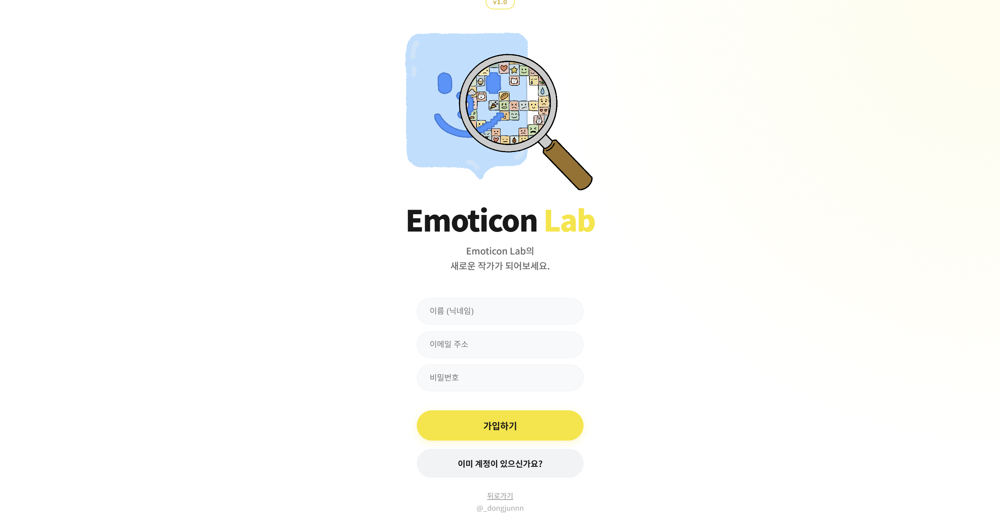 : 회원가입은 닉네임, 이메일, 비밀번호로 진행된다.  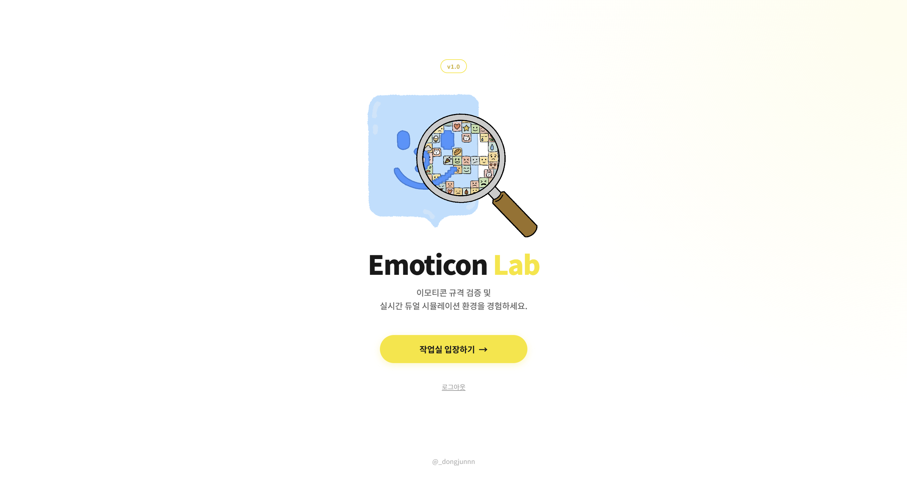  : 로그인을 통해 인증 성공 시 작업실로 이동 할 수 있다. 
* **2) DashboardView**:  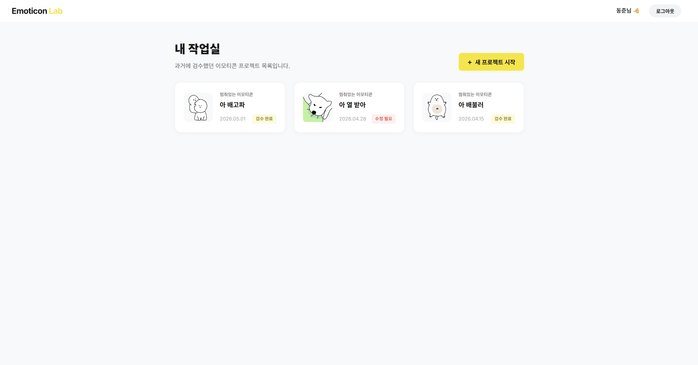 : 과거 프로젝트 목록이 나열되고, 각 프로젝트 선택시 과거 작업을 이어갈 수 있다. 새 프로젝트 시작 시 업로드 창으로 넘어간다.  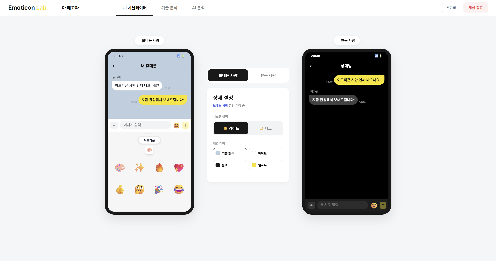 : 과거 프로젝트에 재진입한 시점이다.
* **3) UploadView**:  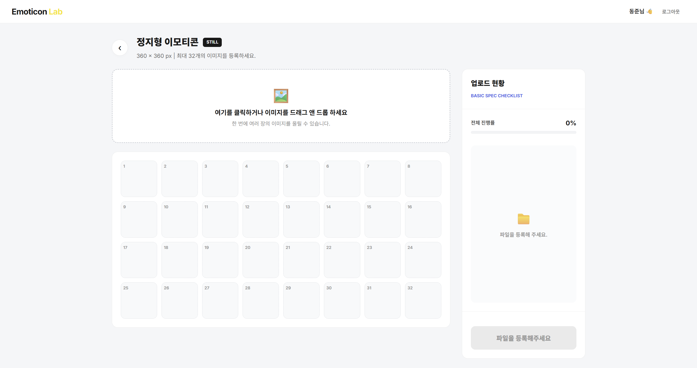 : 업로드 화면이다. 해당 부분 클릭하면 파일 선택기가 열리며 드래그 앤 드롭으로 최대 32종의 이미지를 업로드 할 수 있다.  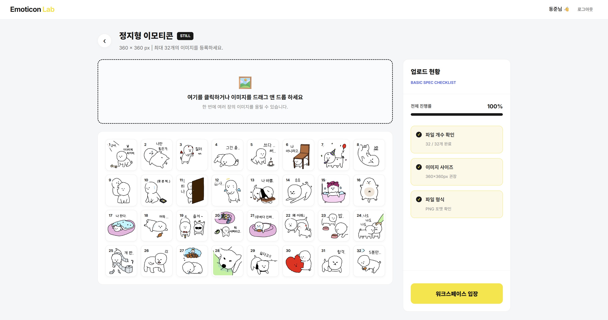 : 32종의 이미지를 업로드한 상태이다. 이미지 사이즈, 파일 형식 등 기본적인 규격을 점검 후에 워크스페이스로 이동할 수 있다.
* **4) Simulator View**:  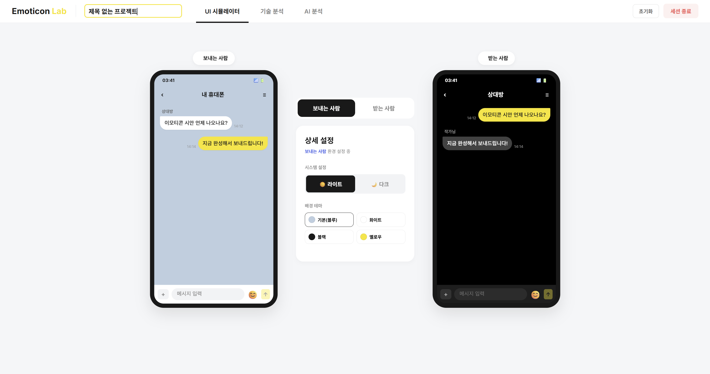 : 워크스페이스 초기 화면이다. 좌측 상단에서 프로젝트의 제목을 설정할 수 있다.  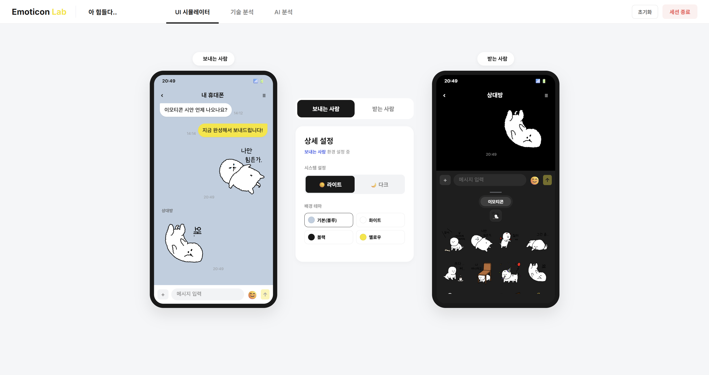 : 시뮬레이션 뷰에선 업로드한 이미지를 Send와 Receiver 입장에서 사용해보고 받아볼 수 있다.  추가로 가운데 인터페이스를 통해 테마를 커스터마이징하여 이모티콘의 가독성도 직접 확인할 수 있다.
* **5) TechnicalView**:  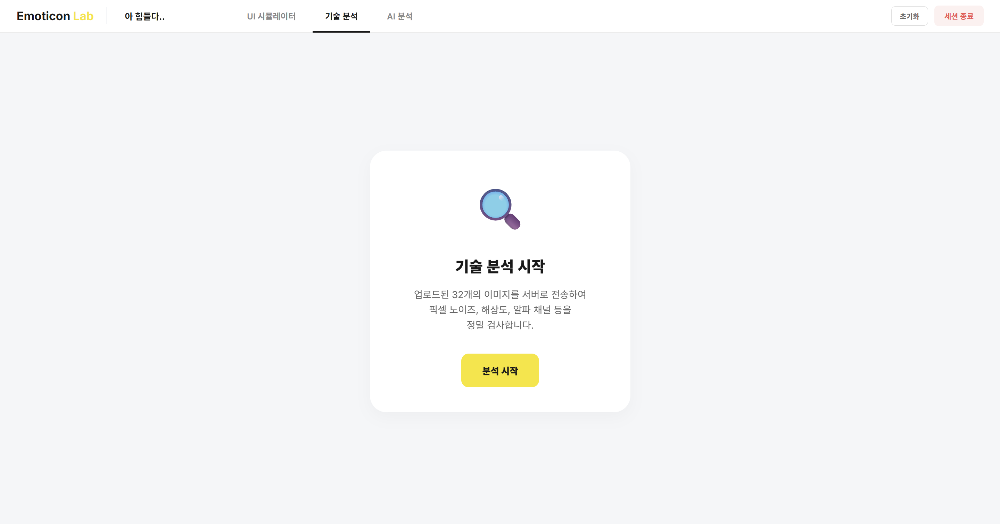 : 기술 분석 탭이다. 분석 시작 버튼을 통해 이미지를 서버로 보내고 픽셀 단위의 분석을 할 수 있다.  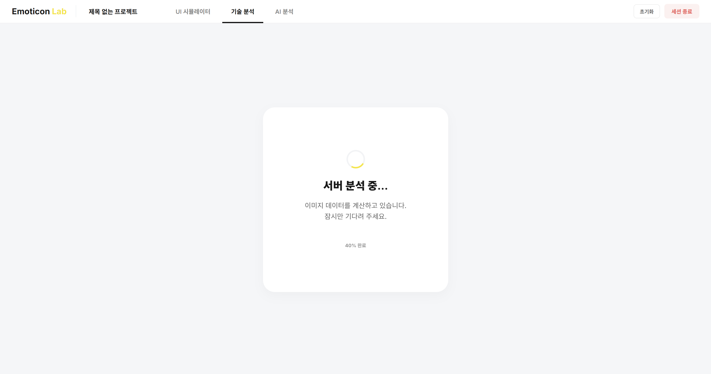 : 분석 데이터를 리턴받을 때까지 로딩을 출력한다.  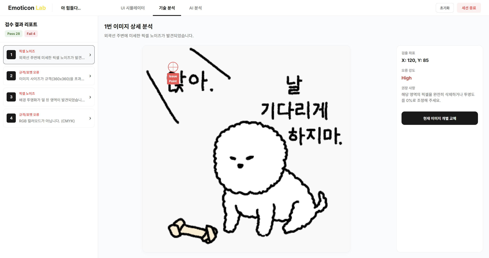  : 기술 분석 결과 Error가 있는 이미지의 id와 분석 내용을 출력하고, 좌표를 받아 이미지 위에 표시한다.  Error를 수정했다면 해당 이미지만 교체하고 현재 프로젝트에 반영할 수 있다.
* **6) AlView**:  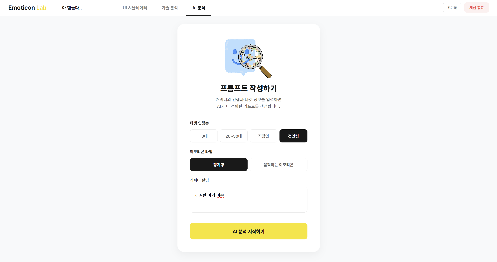 : Al server로 분석 요청을 보내기 전에 현재 프로젝트의 상세 정보를 사용자가 입력할 수 있다. 연령층, 타입, 설명을 통해 분석에 영향을 줄 수 있다.  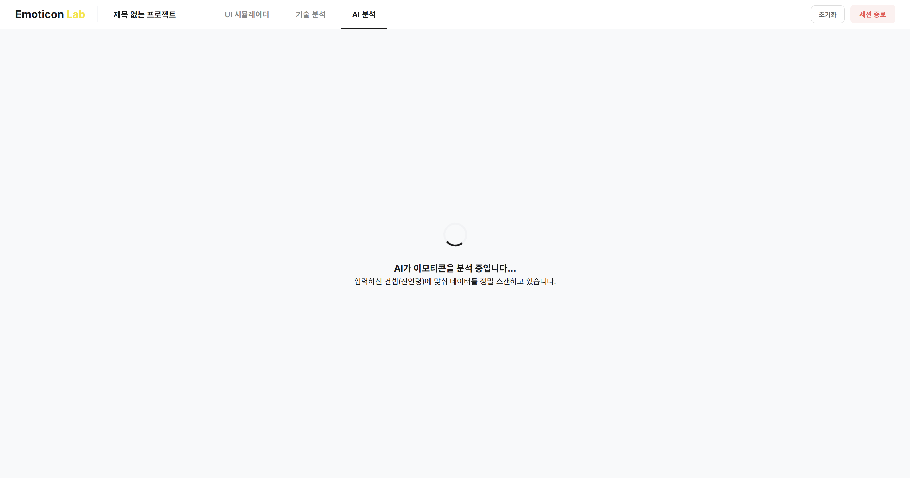 : 분석 데이터를 리턴받을 때까지 로딩을 출력한다. 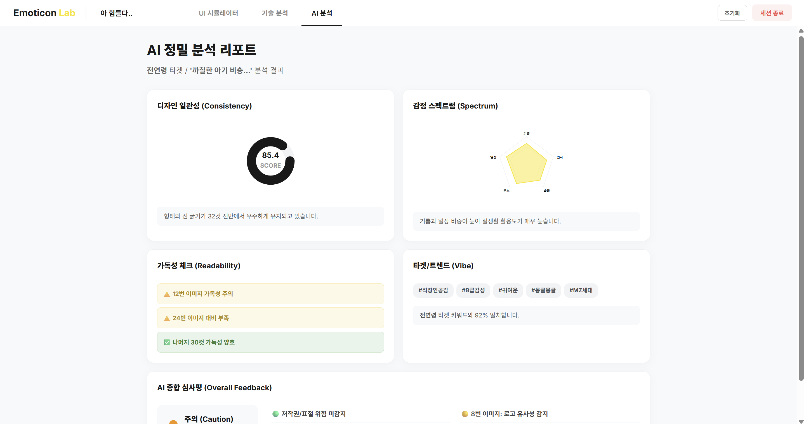 : AI 분석 결과 디자인 일관성, 감정 스펙트럼, 가독성, 트렌드 반영성, 종합 평가를 제공한다.  감정 스펙트럼은 이모티콘 세트의 균형을 시각적으로 표현하기 위해 방사형 그래프를 사용하였다. 
* **7) NavigationBar**:  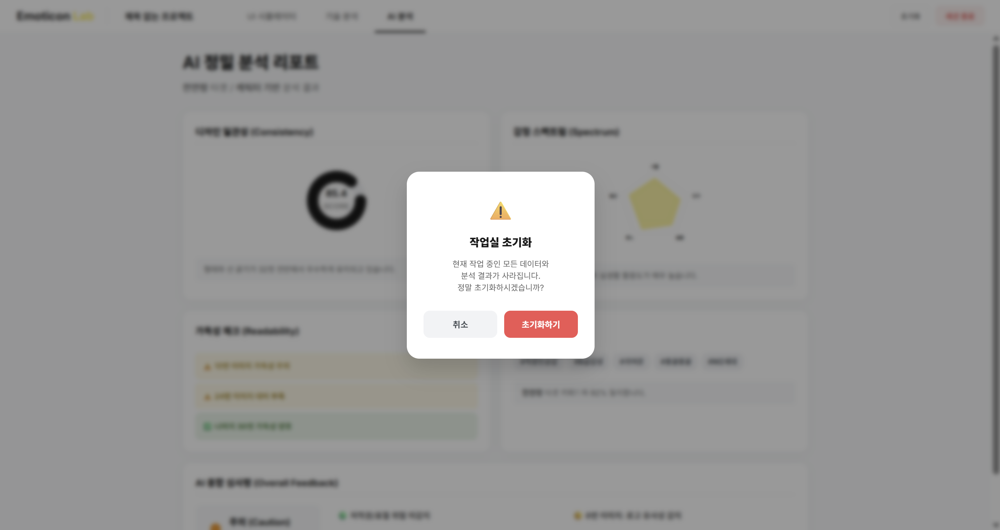 : 워크스페이스의 네비게이션 바에서 초기화를 누를 시 현재 프로젝트를 초기화하는 팝업이 뜨며 초기화하고 업로드뷰로 돌아간다.  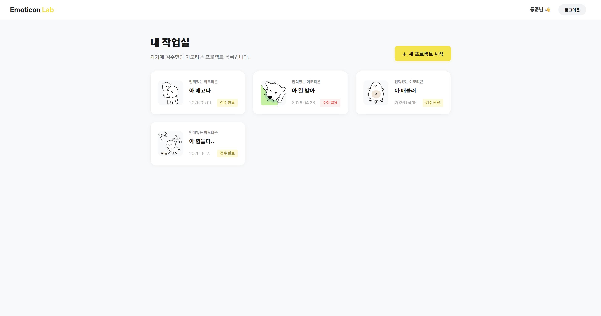 : 워크스페이스의 네비게이션 바에서 세션 종료를 누르면 현재 프로젝트가 저장되고 작업실에 반영된다.

---

## 5. Glossary

* **Stray Pixel (스트레이 픽셀 / 노이즈 픽셀)**: 이모티콘 작업 중 실수로 찍히거나 제대로 지워지지 않아 화면에 남은 불필요한 미세 픽셀 찌꺼기.
* **Workspace (워크스페이스 / 작업실)**: 사용자가 이미지를 업로드하고 기술 검수, AI 분석, UI 시뮬레이션 등의 전 과정을 진행하는 메인 작업 환경.
* **UI Simulator (UI 시뮬레이터)**: 카카오톡 등 실제 메신저 환경과 동일한 가상 채팅방 레이아웃을 제공하여 가독성을 테스트하는 기능.
* **Technical Analysis (기술 검수)**: 이미지의 해상도, 여백 규격, 배경 투명도, 픽셀 노이즈 등을 알고리즘을 통해 수치적으로 판별하는 과정.
* **Al Analysis (AI 정밀 분석)**: 외부 AI 모델을 활용해 이모티콘 32종 세트 전체의 감정 키워드 분포와 캐릭터 컨셉의 시각적 일관성을 평가하는 과정.

---

## 6. References
* [1] 카카오 이모티콘 스튜디오 (Kakao Emoticon Studio), "이모티콘 제안 가이드라인 및 제작 규격". [https://emoticonstudio.kakao.com](https://emoticonstudio.kakao.com)