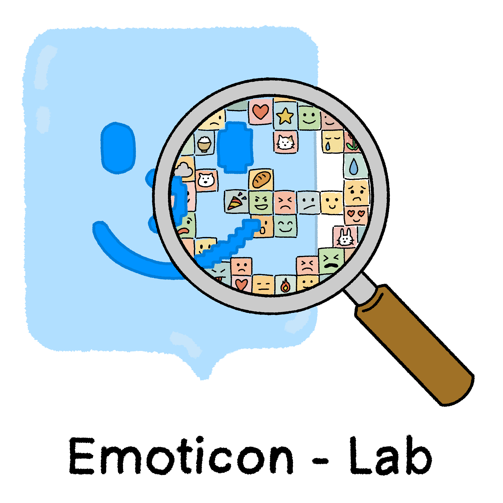
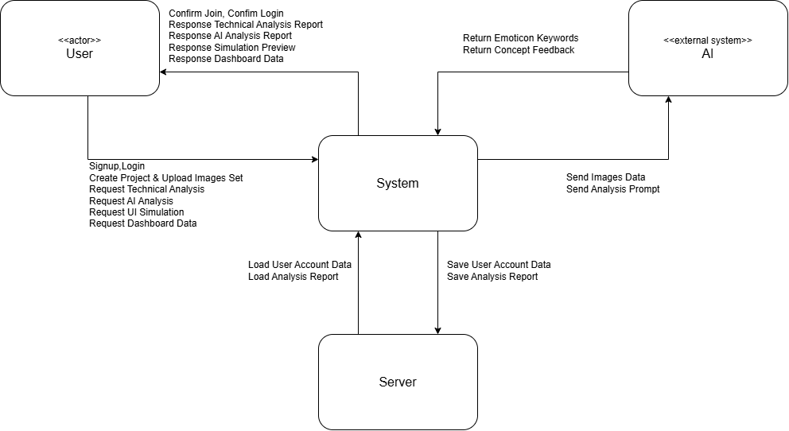

<h1>Emoticon-Lab</h1>
  
**-Conceptualization document-**

| | |
| :--- | :--- |
| **Student No.** | 22212048 |
| **Name** | 김동준 |
| **E-mail** | kdjkdj111@gmail.com |

 

**[ Revision history ]**

| Revision date | Version # | Description | Author |
| :--- | :--- | :--- | :--- |
| 03/27/2026 | 1.0 | First Writing | Kim dong jun |

 

**= Contents =**

1. [Business purpose](#1-business-purpose)
2. [System context diagram](#2-system-context-diagram)
3. [Use case list](#3-use-case-list)
4. [Concept of operation](#4-concept-of-operation)
5. [Problem statement](#5-problem-statement)
6. [Glossary](#6-glossary)
7. [References](#7-references)

---

## 1. Business purpose

### 1.1 프로젝트 배경
2025년 하반기 기준 카카오톡 이모티콘 사용량 3000억 건, 누적 출시작 85만 개를 넘어섰습니다. '이모티콘 플러스'의 등장으로 신생 이모티콘 창작의 문턱이 낮아졌지만, 역설적으로 경쟁률이 증가하면서 신입 작가들이 마주하는 승인 장벽은 그 어느 때보다 높습니다. 대다수의 현역 작가들도 "50건 제안 중 1건 승인"이라는 혹독한 현실 속에서 기업에서는 정확한 반려 사유조차 알려주지 않아 창작 의욕을 상실하고 있습니다.

직접 이모티콘을 제작하고 반려당하는 과정을 겪으며 수많은 동료 작가들의 사례를 분석해보았습니다. 그 결과, 반려의 주된 원인은 작가의 예술적 역량 부족보다 '기술적 정밀도 부족'과 '주관에 치우친 컨셉의 불균형'에 있다는 것을 발견했습니다. 현재 시장에는 제작된 이미지를 단순 배열하여 눈으로 확인하는 기초적인 뷰어 프로그램만 존재할 뿐, 작가들의 실질적인 페인 포인트인 기계적 오류 검출이나 객관적 컨셉 분석을 지원하는 솔루션은 전무합니다. 이를 해결하기 위해 인간이 육안으로 놓치기 쉬운 오류를 잡고, 객관적인 시선을 제공하는 시스템을 구상하게 되었습니다.

**1) 기술적 요구사항 미충족의 측면**
카카오톡 이모티콘 스튜디오가 요구하는 규격, 해상도, 여백, 투명 배경 처리 등은 매우 엄격한 기준을 제시합니다. 특히 육안으로 확인하기 힘든 '미세 픽셀 노이즈'나 '외곽선 잔여물'은 다크모드 사용자에게 눈에 띄는 오류로 주요 반려 사유가 됩니다. 32장 이미지를 사람이 일일이 검수하는 것은 번거로울 뿐만 아니라 휴먼 에러를 피할 수 없습니다.

**2) 컨셉 및 기획의 완성도 부족 측면**
가장 핵심적인 반려 사유로 일관성 없는 드로잉 스타일, 컨셉에 맞지 않는 구성, 혹은 사용성을 고려하지 않은 특정 감정에 치우친 세트 구성은 상품성이 낮다고 판단되어 반려율이 높습니다. 이는 본인이 만든 캐릭터이기에 필연적으로 주관이 개입될 수밖에 없기 때문입니다. '자기 객관화'가 되지 않은 상태에서는 주변의 도움 없이 이러한 기획적 결함을 스스로 발견하기란 불가능에 가깝습니다.

### 1.2 목표 및 핵심 기능
* **1) 기술적 해결:** 알고리즘 기반의 정밀 스캔을 통해, 규격 위반, 여백 오류, 픽셀 찌꺼기를 잡아내어 기술적 반려 사유를 사전 차단합니다.
* **2) 기획적 해결:** 제 3의 눈인 AI를 통해 32종의 감정 키워드, 컨셉의 일관성 등을 검사하고, 이를 그래프로 시각화하여 감정의 분포 혹은 중복을 확인합니다.
* **3) 시뮬레이션:** 실제 채팅방 환경을 조성한 UI에 업로드한 이모티콘 세트를 즉시 대입해봄으로써 가독성을 시각적으로 최종 점검합니다.

### 1.3 타겟 시장
* 명확한 반려 사유를 찾지 못해 어려움을 겪는 신입 및 예비 이모티콘 작가.
* 검수 과정을 자동화하여 작업 효율을 높이고자 하는 베테랑 이모티콘 작가.
* 검수 인력을 절감하고 효율적인 검수 지원 시스템이 필요한 이모티콘 제공 플랫폼

---

## 2. System context diagram

**User <-> System**
* Login / Logout
* Sign up
* Join
* Create Project
* Upload Images Set
* Request & Response Technical Analysis
* Request & Response AI Analysis
* Request & Response UI Simulation setting
* Request & Response Dashboard Data

**System <-> Server**
* Save & Load User Account Data
* Save & Load Analysis Report

**Server <-> External AI Server**
* Send Images Data
* Send Analysis Prompt
* Return Emoticon Keywords
* Return Concept Feedback

---

## 3. Use case list

### 1) Sign Up
| **Actor** | User |
| :--- | :--- |
| **Description** | 사용자가 서비스를 이용하기 위해 새로운 계정을 생성한다. |

### 2) Login
| **Actor** | User |
| :--- | :--- |
| **Description** | 사용자가 자신의 아이디로 로그인하여 시스템에 접속한다. |

### 3) Logout
| **Actor** | User |
| :--- | :--- |
| **Description** | 사용자가 시스템 사용을 끝내고 세션을 마감한다. |

### 4) Upload Image Set
| **Actor** | User |
| :--- | :--- |
| **Description** | 검수할 이미지 세트를 일괄 업로드하여 프로젝트를 생성한다. |

### 5) Re-upload Modified Image
| **Actor** | User |
| :--- | :--- |
| **Description** | 리포트를 바탕으로 수정한 특정 이미지만 개별적으로 업로드하여 해당 파일의 재검수를 진행한다. |

### 6) Request Technical Analysis
| **Actor** | User |
| :--- | :--- |
| **Description** | 이미지의 해상도, 규격, 스트레이 픽셀 등 기술적 분석을 요청한다. |

### 7) Request AI Analysis
| **Actor** | User |
| :--- | :--- |
| **Description** | 이미지 세트를 외부 AI로 전송하여 감정 키워드를 추출하고 컨셉 일관성을 분석하도록 요청한다. |

### 8) View Detailed Report
| **Actor** | User |
| :--- | :--- |
| **Description** | 기술 검수 및 AI분석이 완료된 후, 오류 정보와 차트가 포함된 상세 결과 리포트를 열람한다. |

### 9) View Personal Dashboard
| **Actor** | User |
| :--- | :--- |
| **Description** | 서버에 저장된 과거의 프로젝트 검수 로그 기록들을 대시보드에서 조회한다. |

### 10) Simulate Emoticon on Chat UI
| **Actor** | User |
| :--- | :--- |
| **Description** | 업로드한 이모티콘을 실제 메신저와 동일한 UI의 가상 환경을 통해 시각적 오류와 가독성을 점검한다. |

### 11) Reset Current Workspace
| **Actor** | User |
| :--- | :--- |
| **Description** | 작업 중 데이터가 꼬이거나 새로 시작하고자 할 때, 현재 진행 중인 검수 세션의 데이터를 모두 초기화하여 세트를 재생성한다. |

---

## 4. Concept of operation

### 1) Sign Up
| 구분 | 내용 |
| :--- | :--- |
| **Purpose** | 서비스를 이용하기 위해 사용자 정보를 등록 |
| **Approach** | 사용자가 로그인 화면에서 'Sign Up'버튼을 누를 경우 고객 정보 입력 화면을 전환. 입력 후 '확인' 버튼을 누를 시 서버에 고객 정보를 저장. |
| **Dynamics** | 서비스 최초 이용시 사용자 정보가 등록이 되어있지 않을 경우 |
| **Goals** | 신규 사용자의 계정을 생성하고 시스템 접근 권한을 부여한다. |

### 2) Login
| 구분 | 내용 |
| :--- | :--- |
| **Purpose** | 서비스를 사용하기 위해 등록된 사용자인지 확인 |
| **Approach** | 사용자가 시스템 접속 후 로그인 시, ID, PW를 입력 후 로그인을 요청하면 서버에서 회원 정보를 조회 후 로그인 성공/실패 여부 확인한다. |
| **Dynamics** | 시스템 접속 시 로그인할 경우 |
| **Goals** | 사용자 인증을 통해 개인 작업 환경에 접근할 수 있도록 세션을 생성한다. |

### 3) Logout
| 구분 | 내용 |
| :--- | :--- |
| **Purpose** | 현재 로그인된 사용자의 세션을 종료하여 안전하게 앱 사용을 마침. |
| **Approach** | 사용자가 시스템 화면에서 '로그아웃' 버튼을 누를 경우, 서버 및 로컬에 저장된 사용자 인증 세션을 파기하고 초기 로그인 화면을 전환한다. |
| **Dynamics** | 사용자가 서비스 사용을 마치거나 다른 계정으로 접속하려 할 경우 |
| **Goals** | 현재 사용자 세션을 파기하고 계정 보안을 유지한다. |

### 4) Upload Image Set
| 구분 | 내용 |
| :--- | :--- |
| **Purpose** | 검수할 32종의 이모티콘 이미지를 시스템에 등록하여 작업 환경 구축. |
| **Approach** | 사용자가 파일 탐색기를 통해 32개의 이모티콘 이미지를 일괄 선택하여 업로드 하면 시스템이 이를 그리드형 UI에 순서대로 매핑하여 화면에 출력한다. |
| **Dynamics** | 이모티콘 검수 프로젝트를 시작할 경우 |
| **Goals** | 32종의 이미지를 시스템 메모리에 로드하고 검수 작업 공간을 생성한다. |

### 5) Re-upload Modified Image
| 구분 | 내용 |
| :--- | :--- |
| **Purpose** | 검수에서 오류가 발생한 특정 이미지만 개별적으로 교체하여 수정. |
| **Approach** | 검수 리포트 확인 후, 에러가 발생한 이미지를 수정하여 덮어씌우면 해당 이미지만 교체하여 화면을 갱신한다. |
| **Dynamics** | 검사 후, 반려 사유가 발생한 이미지만 수정한 뒤 재검수가 필요할 경우 |
| **Goals** | 수정된 개별 이미지를 교체하고 이미지 그리드를 갱신한다.  |

### 6) Request Technical Analysis
| 구분 | 내용 |
| :--- | :--- |
| **Purpose** | 이모티콘의 기계적 규격 및 픽셀 오류 등을 자동 검출. |
| **Approach** | 사용자가 '기술 검수' 버튼을 누르면, 시스템 내장 알고리즘이 실행되어 투명도, 여백 규정 위반 및 스트레이 픽셀의 좌표를 찾아낸다. |
| **Dynamics** | 업로드된 이미지의 물리적인 규격 오류나 노이즈를 확인하고 싶을 경우. |
| **Goals** | 기술적 오류 자동 검출을 요청한다. |

### 7) Request AI Analysis
| 구분 | 내용 |
| :--- | :--- |
| **Purpose** | 이모티콘 세트 전체의 감정 분포와 컨셉 일관성을 객관적으로 평가. |
| **Approach** | 사용자가 'AI분석' 버튼을 누르면, 업로드 된 이미지 세트를 외부 AI로 전송하여 각 이미지의 감정 키워드를 추출하고 세트 전체의 컨셉 일관성 평가 지표를 반환 받는다. |
| **Dynamics** | 이모티콘 세트의 감정 분포 및 객관적 피드백이 필요할 경우. |
| **Goals** | 외부 AI API와 연동 및 검수 프롬프트를 전달한다. |

### 8) View Detailed Report
| 구분 | 내용 |
| :--- | :--- |
| **Purpose** | 기술 검수 또는 AI분석의 상세 결과를 시각적으로 확인하고 저장. |
| **Approach** | 각 분석이 완료되면 이미지별로 오류 내역을 확인하거나, AI가 분석한 감정 분포를 차트 형태로 화면에 렌더링하여 검수 및 데이터를 서버에 저장한다. |
| **Dynamics** | 기술 검수 또는 AI 분석 요청이 완료되어 시스템으로부터 결과가 반환된 직후. |
| **Goals** | 검수 리포트 팝업 및 차트를 시각화하여 사용자에게 직관적인 피드백을 제공한다. |

### 9) View Personal Dashboard
| 구분 | 내용 |
| :--- | :--- |
| **Purpose** | 과거에 작업했던 이모티콘 프로젝트 목록과 검수 기록을 조회. |
| **Approach** | 사용자가 마이페이지 메뉴로 이동하면, 서버에 저장된 해당 사용자의 과거 검수 세션과 리포트 데이터를 리스트 형태로 나열한다. |
| **Dynamics** | 사용자가 이전 작업 내역 및 피드백 기록을 다시 열람하고자 할 경우. |
| **Goals** | DB에서 해당 사용자의 id를 기반으로 과거 작업 이력을 조회한다. |

### 10) Simulate Emoticon on Chat UI
| 구분 | 내용 |
| :--- | :--- |
| **Purpose** | 실제 메신저 환경에서의 시각적 오류 및 가독성을 점검. |
| **Approach** | 업로드한 이미지를 가상의 대화방 환경을 통해 직접 시뮬레이션 하고, 사용자가 시뮬레이션 환경을 실시간으로 조정할 수 있다. |
| **Dynamics** | 이미지 업로드 후, 테마별 가독성 및 시각적 퀄리티를 눈으로 직접 확인한다. |
| **Goals** | 실제와 동일한 채팅방 UI를 조성하고 테마를 전환하여 시뮬레이션한다. |

### 11) Reset Current Workspace
| 구분 | 내용 |
| :--- | :--- |
| **Purpose** | 현재 진행 중인 세션을 초기화하여 새로운 작업을 준비. |
| **Approach** | 사용자가 '초기화' 버튼을 누를 경우, 현재 세션에 로드된 이미지와 검수 데이터를 메모리에서 삭제하고 초기 빈 화면으로 되돌린다. |
| **Dynamics** | 작업 중 데이터가 꼬였거나, 현재 작업을 취소하고 새로운 세트를 처음부터 업로드하고 싶을 경우 |
| **Goals** | 현재 작업 세션을 초기화하여 메모리를 비우며 새 프로젝트를 생성하고, 쾌적한 새 작업 환경을 제공한다. |

---

## 5. Problem statement

**Problem #1 이미지 동시 처리로 인한 성능 저하**
* 다중 사용자가 32종의 이미지를 일괄 업로드하고 시스템이 이를 동시에 내부 알고리즘으로 분석할 경우, 서버 메모리 과부하 및 응답 지연이 발생할 수 있다.

**Problem #2 알고리즘의 픽셀 오탐지**
* 창작자가 의도적으로 외곽 여백을 두지 않거나, 의도적으로 그린 독립된 픽셀을 알고리즘이 스트레이 픽셀로 오인하거나 잘못된 에러 리포트를 출력할 경우가 발생할 수 있다.

**Problem #3 브라우저에 따른 가상 채팅방 UI 렌더링 문제**
* 사용자마다 사용하는 브라우저 환경 차이로 인해, 가상 채팅방 UI의 레이아웃이나 테마가 일관되게 표시되지 않고 깨질 위험이 있다.

**Problem #4 외부 AI 서버 지연 및 API 사용 횟수 제한**
* 외부 AI 서버의 상태에 따라 네트워크 지연이 발생할 수 있으며, 과도한 API 사용으로 할당량을 초과하여 시스템의 AI 분석이 마비될 수 있다.

**Problem #5 AI 망각 및 환각 현상**
* AI 프롬프트 전달 및 분석 결과 리턴 과정에서 AI가 프롬프트를 망각하여 잘못된 키워드를 반환하거나, 프롬프트에 맞지 않는 형식을 반환할 기술적 위험이 있다.

**NFRs**
* 1. 시스템은 32종 이미지 업로드 및 기술 검수 로직 처리를 사용자가 요청한 시점으로부터 최대 5초 이내에 완료하여 서버 병목을 방지해야 한다.
* 2. 가상 채팅방 시뮬레이션 환경은 여러 환경에서 시각적 오차 없이 동일한 CSS 렌더링을 보장해야 하며, 시뮬레이션 테마 전환에 지연이 없어야 한다.
* 3. 알고리즘 오탐지를 방지하기 위해, 사용자가 특정 검수를 수동으로 무시하고 강제 통과시킬 수 있는 예외 권한을 제공하여야 한다.
* 4. 외부 AI API 응답 지연 시간이 3초를 초과하면 요청을 중단하고, AI 서버 지연 안내 메세지를 표시해야 한다.
* 5. API 호출 횟수를 제한하고 할당량 제한에 도달하면 시스템 에러 로그를 통해 알리며 AI 검수 기능을 비활성화하되, 기술적 픽셀 검수는 정상 작동하도록 모듈을 분리해야 한다.
* 6. AI 망각 현상을 방지하기 위해, 시스템은 반환된 결과값의 무결성을 검증하고, 형식이 맞지 않을 경우 재요청하는 로직을 포함해야 한다.

---

## 6. Glossary

* **스트레이 픽셀(Stray pixel):** 배경 투명화 후, 캐릭터와 연결되지 않고 독립적으로 이미지에 남아있는 미세한 픽셀 찌꺼기.
* **감정 키워드(Emotion Keywords):** 이모티콘 세트 내 각 이미지가 나타내는 주된 감정. 시스템이 이를 분석 하여 세트의 감정 다양성과 중복 여부를 판단.
* **컨셉 일관성(Concept Consistency):** 이모티콘 세트 전체에서 유지되는 그림체, 선의 굵기, 색감, 캐릭터의 비례 등이 통일되어 있는 정도.
* **여백 규정(Margin Guidelines):** 이모티콘 이미지가 채팅창 UI 내에서 잘리지 않거나 가독성 확보를 위해 캐릭터 외곽과 이미지 테두리 사이에 두어야 하는 최소한의 빈 공간.
* **AI 환각(AI Hallucination):** 인공지능이 데이터 분석 과정에서 실제 내용과 무관한 정보를 생성하거나, 존재하지 않는 오류를 지어내어 답변하는 현상.
* **프롬프트(Prompt):** 외부 AI 서버에 분석을 요청할 때 전달하는 구체적인 명령문 또는 지시 사항.

---

## 7. References

* [1] 카카오 이모티콘 스튜디오 (Kakao Emoticon Studio), "이모티콘 제안 가이드라인 및 제작 규격", https://emoticonstudio.kakao.com
* [2] 카카오 뉴스, "카카오 이모티콘 14주년...누적 이모티콘 수 85만 개·누적 발신량 3천억 건 돌파", https://www.kakaocorp.com/page/detail/11818