

<h1>Emoticon-Lab</h1>

**-Design document-**

| | |
| :--- | :--- |
| **Student No.** | 22212048 |
| **Name** | 김동준 |
| **E-mail** | kdjkdj111@gmail.com |

 

**[ Revision history ]**

| Revision date | Version # | Description | Author |
| :--- | :--- | :--- | :--- |
| 06/03/2026 | 1.00 | init Document | Kim Dong Jun |

 

## = Contents =

1. [Introduction](#1-introduction)
2. [Class diagram](#2-class-diagram)
3. [Sequence diagram](#3-sequence-diagram)
4. [State machine diagram](#4-state-machine-diagram)
5. [Implementation requirements](#5-implementation-requirements)
6. [Glossary](#6-glossary)
7. [References](#7-references)

---

## 1. Introduction

본 문서는 지난 Analysis 단계에서 정의한 요구사항을 기반으로, 사용자 경험(UX) 최적화와 시스템의 기술적 안정성을 동시에 구현하기 위한 'Emoticon-Lab'의 상세 설계 문서입니다.

본 시스템은 이모티콘 제작이라는 창작 과정을 기술적으로 지원하기 위해 고안되었으며, 본 시스템의 구조를 체계적으로 도식화하였습니다. 우선 클래스 다이어그램(Class Diagram)을 통해 시스템 아키텍처의 뼈대를 설계하였으며, 시퀀스 다이어그램(Sequence Diagram)으로 사용자 인터랙션과 기능적 흐름을 구체화하였습니다. 더불어, 상태 머신 다이어그램(State Machine Diagram)을 도입하여 복잡한 이미지 분석 프로세스 전반에서 발생하는 시스템의 상태 변화를 정의하였습니다.

또한, Emoticon-Lab은 사용자의 접근성을 고려하여 웹 서비스 기반의 아키텍처를 채택하였습니다. 본 명세서에 기술된 설계를 바탕으로 Emoticon-Lab은 단순한 검수 도구를 넘어, 예비 작가들에게 최적의 창작 환경을 제공하는 지능형 분석 플랫폼으로 발전할 것입니다. 본 문서는 시스템의 전반적인 구조를 상세히 제시하여, 시스템 구현을 위한 설계도가 됩니다.

---

## 2. Class diagram

본 프로젝트는 백엔드와 프론트엔드를 나누어 구현하는 구조로 설계되었습니다.
Spring Boot+ReactView 조합을 채택하였으며, 다이어그램 상단은 프론트엔드의 View class, 하단은 백엔드의 내부 연산 및 데이터 도메인을 담당합니다.
주요 View, Class 및 dataType을 명시하였고, 외부 서비스 및 연산은 일부 생략하였습니다.

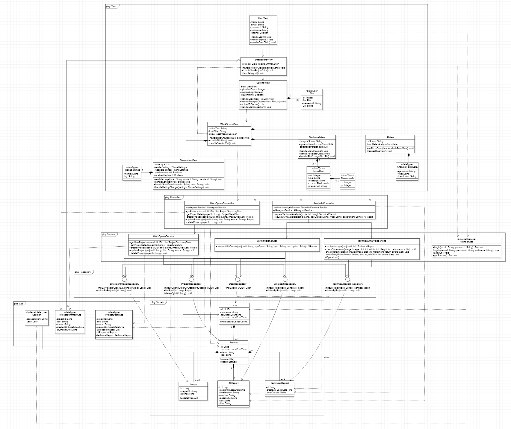

각 클래스의 역할별로 패키지를 View, Controller, Service, Repository, Domain으로 구분하였습니다. View와 Controller간의 상호작용은 REST API 통신으로 연결됩니다.
Dto 패키지를 통하여 프론트 클래스와 백 클래스 간의 데이터 결합도를 낮추었습니다.

---

### 2.1 View class

본 다이어그램은 프론트엔드의 사용자 인터페이스를 구성하는 View class 구조를 나타냅니다. 본 프로젝트는 React 기반의 컴포넌트 구조를 전제로 설계되었습니다.

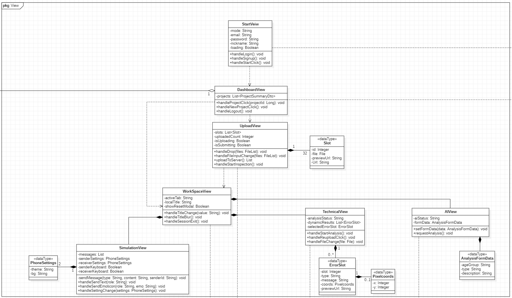

전체적인 화면 흐름은 StartView(로그인/회원가입)에서 시작하여 프로젝트 목록을 볼 수 있는 DashboardView를 통해 UploadView로 가거나, WorkSpaceView로 바로 진입할 수 있는 구조입니다.
WorkSpaceView는 SimulatorView, TechnicalView, AIVIew를 포함하고 있으며 이는 activeTap 변수를 통한 탭 상태 전환 형태로 구성됩니다. 상위 뷰인 WorkSpaceView가 하위 세부 기능 뷰들과 생명주기를 공유하여 복합 관계를 가집니다.

또한 각 기능 뷰들은 구현에 필요한 PhoneSettings, ErrorSlot, AnalysisFormData 등 커스텀 dataType을 속성으로 가지며 처리됩니다.

---

#### 2.1.1 StartView Description

| StartView | |
| :--- | :--- |
| **Class Description** | 시스템의 진입점 역할을 하며 사용자 로그인, 회원가입, 시작을 처리하는 UI 뷰 클래스 |

**Attributes**

| 구분 | | | | |
| :--- | :--- | :--- | :--- | :--- |
| **Name** | **Type** | **Scope** | **Visibility** | |
| **Description** | | | | |
| mode | String | instance | private | |
| StartView 내 현재 화면 모드 상태 (시작/로그인/회원가입) | | | | |
| email | String | instance | private | |
| 사용자 입력 이메일 | | | | |
| password | String | instance | private | |
| 사용자 입력 비밀번호 | | | | |
| nickname | String | instance | private | |
| 사용자 입력 닉네임 | | | | |
| isLoading | Boolean | Instance | private | |
| 데이터 로딩 진행 상태 여부를 확인하고 버튼을 비활성화하여 중복 요청 방지 | | | | |

**Operation**

| 구분 | | | | | |
| :--- | :--- | :--- | :--- | :--- | :--- |
| **Name** | **Argument** | **Returns** | **Scope** | **Visibility** | |
| **Description** | | | | | |
| handleLogin | None | void | instance | public | |
| 로그인 처리 이벤트 | | | | | |
| handleSignup | None | void | instance | public | |
| 회원가입 처리 이벤트 | | | | | |
| handleStartClick | None | void | instance | public | |
| 시작 버튼 클릭 이벤트(DashboardView 진입) | | | | | |

---

#### 2.1.2 DashboardView Description

| DashboardView | |
| :--- | :--- |
| **Class Description** | 로그인 후 이동되는 메인 대시보드 화면으로, 사용자의 프로젝트 목록을 보여주고 특정 프로젝트를 선택하여 Workspace로 이동하게 해주는 UI 뷰 클래스 |

**Attributes**

| 구분 | | | | |
| :--- | :--- | :--- | :--- | :--- |
| **Name** | **Type** | **Scope** | **Visibility** | |
| **Description** | | | | |
| projects | List\<ProjectSummaryDto\> | instance | private | |
| 사용자가 보유한 프로젝트들의 요약 정보 목록 | | | | |

**Operation**

| 구분 | | | | | |
| :--- | :--- | :--- | :--- | :--- | :--- |
| **Name** | **Argument** | **Returns** | **Scope** | **Visibility** | |
| **Description** | | | | | |
| handleProjcetClick | projectId: Long | void | instance | public | |
| 개별 프로젝트 항목 클릭 시 해당 작업 공간으로 이동하는 이벤트 | | | | | |
| handleNewProjectClick | None | void | instance | public | |
| 새 프로젝트 시작 버튼 클릭 시 업로드 화면으로 이동하는 이벤트 | | | | | |
| handleLogout | None | void | instance | public | |
| 로그아웃 처리 이벤트 | | | | | |

---

#### 2.1.3.1 UploadView Description

| UploadView | |
| :--- | :--- |
| **Class Description** | 사용자가 검수할 이미지를 업로드하고, 서버로 전송하여 검수를 요청하는 UI 뷰 클래스 |

**Attributes**

| 구분 | | | | |
| :--- | :--- | :--- | :--- | :--- |
| **Name** | **Type** | **Scope** | **Visibility** | |
| **Description** | | | | |
| slots | List\<Slot\> | instance | private | |
| 이미지가 업로드될 슬롯 목록 | | | | |
| uploadedCount | Integer | instance | private | |
| 현재 업로드 완료된 이미지의 개수 | | | | |
| isUploading | Boolean | instance | private | |
| 이미지 업로드 프로세스 진행 여부 | | | | |
| isSubmitting | Boolean | instance | private | |
| 분석 시작 버튼을 누른 후 서버 제출 진행 여부(중복 호출 방지) | | | | |

**Operation**

| 구분 | | | | | |
| :--- | :--- | :--- | :--- | :--- | :--- |
| **Name** | **Argument** | **Returns** | **Scope** | **Visibility** | |
| **Description** | | | | | |
| handleDrop | files: FileList | void | instance | public | |
| 이미지를 드래그 앤 드롭하여 업로드하는 동작 처리 | | | | | |
| handleFileInputChange | files: FileList | void | instance | public | |
| 이미지 편집 변경 사항 처리 | | | | | |
| uploadToServer | None | List | instance | public | |
| 업로드 완료된 이미지들을 서버로 전송 | | | | | |
| handleStartInspection | None | void | instance | public | |
| 검수 시작 버튼 클릭 이벤트 처리 | | | | | |

#### 2.1.3.2 Slot Description

| Slot | |
| :--- | :--- |
| **Class Description** | 업로드 뷰에서 개별 슬롯 하나의 상태와 파일 정보를 관리하는 데이터 구조 |

**Attributes**

| 구분 | | | | |
| :--- | :--- | :--- | :--- | :--- |
| **Name** | **Type** | **Scope** | **Visibility** | |
| **Description** | | | | |
| id | Integer | instance | private | |
| 각 슬롯을 구분하기 위한 고유 식별자 번호 | | | | |
| file | File | instance | private | |
| 사용자가 해당 슬롯에 업로드한 원본 파일 객체 | | | | |
| previewUrl | String | instance | private | |
| 화면에 즉시 띄워주기 위한 임시 미리보기 썸네일 이미지 주소 | | | | |
| Url | String | instance | private | |
| 최종적으로 확정되거나 서버와 매핑될 실제 이미지 경로 | | | | |

---

#### 2.1.4 WorkSpaceView Description

| WorkSpaceView | |
| :--- | :--- |
| **Class Description** | 프로젝트 수행의 메인 화면으로, 시뮬레이션, 기술 분석, AI분석 등의 하위 뷰를 탭 형식으로 관리하고 프로젝트 제목 설정 및 세션 종료를 담당하는 컨테이너 뷰 클래스 |

**Attributes**

| 구분 | | | | |
| :--- | :--- | :--- | :--- | :--- |
| **Name** | **Type** | **Scope** | **Visibility** | |
| **Description** | | | | |
| activeTab | String | instance | private | |
| 현재 화면에 활성화된 하위 탭 정보 | | | | |
| localTitle | String | instance | private | |
| 사용자가 수정한 현재 프로젝트의 제목 | | | | |
| showResetModal | Boolean | instance | private | |
| 워크스페이스 초기화 확인 모달창 표시 여부 | | | | |

**Operation**

| 구분 | | | | | |
| :--- | :--- | :--- | :--- | :--- | :--- |
| **Name** | **Argument** | **Returns** | **Scope** | **Visibility** | |
| **Description** | | | | | |
| handleTitleChange | value: String | void | instance | public | |
| 프로젝트 제목 변경 시 로컬 상태 업데이트 | | | | | |
| handleTitleBlur | None | void | instance | public | |
| 제목 입력창 포커스 해제 시 Database 변경 사항 반영 | | | | | |
| handleSessionExit | None | void | instance | public | |
| 현재 작업 공간 세션을 종료하고 대시보드로 이동 | | | | | |

---

#### 2.1.5.1 SimulatorView Description

| class name | |
| :--- | :--- |
| **Class Description** | 실제 메신저 환경과 유사한 UI를 제공하여, 발신자와 수신자 입장에서 이모티콘이 어떻게 보이는지 테스트하고 시뮬레이션하는 UI 뷰 클래스 |

**Attributes**

| 구분 | | | | |
| :--- | :--- | :--- | :--- | :--- |
| **Name** | **Type** | **Scope** | **Visibility** | |
| **Description** | | | | |
| messages | List | instance | private | |
| 시뮬레이션 화면에 표시되는 메시지(텍스트 및 이모티콘) 목록 | | | | |
| senderSettings | PhoneSettings | instance | private | |
| 발신자 화면의 테마 및 배경 설정 정보 | | | | |
| receiverSettings | PhoneSettings | instance | private | |
| 수신자 화면의 테마 및 폰트 설정 정보 | | | | |
| senderKeyboard | Boolean | instance | private | |
| 시뮬레이션 내 발신자 가상 키보드 상태 | | | | |
| receiverKeyboard | Boolean | instance | private | |
| 시뮬레이션 내 수신자 가상 키보드 상태 | | | | |

**Operation**

| 구분 | | | | | |
| :--- | :--- | :--- | :--- | :--- | :--- |
| **Name** | **Argument** | **Returns** | **Scope** | **Visibility** | |
| **Description** | | | | | |
| sendMessage | type: String, content: String, senderId: String | void | instance | private | |
| 텍스트 및 이모티콘 등 모든 종류의 메시지 데이터를 통합하여 상태(messages)에 저장 | | | | | |
| handleSendText | role: String | void | instance | public | |
| 입력창에 작성된 텍스트 메시지를 전송하는 이벤트 처리 | | | | | |
| handleSendEmoticon | role: String, emo: String | void | instance | public | |
| 선택한 이모티콘을 시뮬레이션 화면에 전송 | | | | | |
| handleSettingChange | settings: PhoneSettings | void | instance | public | |
| 발신자 또는 수신자 화면의 테마(라이트/다크) 및 배경 색상을 변경하는 이벤트 처리 | | | | | |

#### 2.1.5.2 PhoneSettings Description

| PhoneSettings | |
| :--- | :--- |
| **Class Description** | 시뮬레이션 화면에 표시될 메신저의 테마 및 배경 스타일 설정을 저장하는 데이터 구조 |

**Attributes**

| 구분 | | | | |
| :--- | :--- | :--- | :--- | :--- |
| **Name** | **Type** | **Scope** | **Visibility** | |
| **Description** | | | | |
| theme | String | instance | private | |
| UI 테마 설정 값 | | | | |
| bg | String | instance | private | |
| 시뮬레이션 화면의 배경 설정 값 | | | | |

---

#### 2.1.6.1 TechnicalView Description

| TechnicalView | |
| :--- | :--- |
| **Class Description** | 이모티콘의 규격, 여백 등 기술적인 요소에 대한 검수를 수행하고, 발견된 에러 내역을 리스트 형태로 확인 및 관리하는 UI 뷰 클래스 |

**Attributes**

| 구분 | | | | |
| :--- | :--- | :--- | :--- | :--- |
| **Name** | **Type** | **Scope** | **Visibility** | |
| **Description** | | | | |
| analysisStatus | String | instance | private | |
| 현재 기술 검수 진행 상태 | | | | |
| dynamicResults | List\<ErrorSlot\> | instance | private | |
| 검수 결과로 도출된 에러 항목들의 목록 | | | | |
| selectedErrorSlot | ErrorSlot | instance | private | |
| 사용자가 화면에서 상세히 보기 위해 선택한 특정 에러 항목 | | | | |

**Operation**

| 구분 | | | | | |
| :--- | :--- | :--- | :--- | :--- | :--- |
| **Name** | **Argument** | **Returns** | **Scope** | **Visibility** | |
| **Description** | | | | | |
| handleStartAnalysis | None | void | instance | public | |
| 기술 검수 시작 요청 이벤트 처리 | | | | | |
| handleReuploadClick | None | void | instance | public | |
| 수정 이미지를 입력하기 위해 파일 탐색기를 띄우는 함수 | | | | | |
| handleFileChange | file: File | void | instance | public | |
| 파일 변경 및 재업로드 처리 로직 | | | | | |

#### 2.1.6.2 ErrorSlot Description

| ErrorSlot | |
| :--- | :--- |
| **Class Description** | 기술 검수 중 발견된 에러의 위치와 세부 정보를 담는 데이터 구조 |

**Attributes**

| 구분 | | | | |
| :--- | :--- | :--- | :--- | :--- |
| **Name** | **Type** | **Scope** | **Visibility** | |
| **Description** | | | | |
| slot | Integer | instance | private | |
| 에러가 발생한 이미지 슬롯 번호 | | | | |
| type | String | instance | private | |
| 에러의 종류 | | | | |
| message | String | instance | private | |
| 에러 관련 상세 안내 메시지 | | | | |
| coords | Pixelcoords | instance | private | |
| 에러가 발생한 픽셀 좌표 정보 (좌표가 없는 에러일 경우 null) | | | | |
| previewUrl | String | instance | private | |
| 에러 발생 부분을 보여주는 미리보기 이미지 주소 | | | | |

#### 2.1.6.3 Pixelcoords Description

| Pixelcoords | |
| :--- | :--- |
| **Class Description** | 이미지 상의 구체적인 X, Y 에러 좌표 값을 저장하는 데이터 구조 |

**Attributes**

| 구분 | | | | |
| :--- | :--- | :--- | :--- | :--- |
| **Name** | **Type** | **Scope** | **Visibility** | |
| **Description** | | | | |
| x | Integer | instance | private | |
| X축 좌표 값 | | | | |
| y | Integer | instance | private | |
| Y축 좌표 값 | | | | |

---

#### 2.1.7.1 AIView

| AIView | |
| :--- | :--- |
| **Class Description** | 타겟 연령대 및 컨셉 등을 설정하여 AI 분석을 요청하고, 결과 리포트를 출력하는 UI 뷰 클래스 |

**Attributes**

| 구분 | | | | |
| :--- | :--- | :--- | :--- | :--- |
| **Name** | **Type** | **Scope** | **Visibility** | |
| **Description** | | | | |
| aiStatus | String | instance | private | |
| 현재 AI 분석 진행 상태 | | | | |
| formData | AnalysisFormData | instance | private | |
| 사용자가 입력한 AI 분석 요청 폼 데이터 | | | | |

**Operation**

| 구분 | | | | | |
| :--- | :--- | :--- | :--- | :--- | :--- |
| **Name** | **Argument** | **Returns** | **Scope** | **Visibility** | |
| **Description** | | | | | |
| setFormData | data: AnalysisFormData | void | instance | public | |
| 사용자 입력 폼 데이터 저장 | | | | | |
| requestAnalysis | None | void | instance | public | |
| 설정된 폼 데이터를 기반으로 외부 서버에 AI 분석 요청 | | | | | |

#### 2.1.7.2 AnalysisFormData Description

| AnalysisFormData | |
| :--- | :--- |
| **Class Description** | 사용자가 AI 분석을 요청할 때 뷰에서 입력하는 폼 데이터를 저장하는 데이터 구조 |

**Attributes**

| 구분 | | | | |
| :--- | :--- | :--- | :--- | :--- |
| **Name** | **Type** | **Scope** | **Visibility** | |
| **Description** | | | | |
| ageGroup | String | instance | private | |
| 분석 대상의 타겟 연령대 그룹 | | | | |
| type | String | instance | private | |
| 분석 모델의 유형 또는 컨셉 종류 | | | | |
| description | String | instance | private | |
| 사용자가 추가로 입력한 상세 설명 문구 | | | | |

---

### 2.2 Controller Class Diagram

본 다이어그램은 프론트엔드와 백엔드 로직 사이의 통신 인터페이스 역할을 수행하는 Controller 구조를 나타냅니다. View 계층에서 발생하는 REST API 요청을 수신하고, 이를 적절한 Service 클래스로 전달합니다.

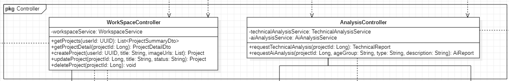

도메인의 목적에 따라 크게 사용자의 프로젝트와 관련된 전반적인 요청을 처리하는 WorkSpaceController와 본 시스템의 핵심 기능인 분석 요청을 전담하는 AnalysisController로 분리되어 있습니다.
결과적으로 Controller Class는 프론트엔드의 화면 로직과 백엔드의 내부 연산 로직을 분리하여, 시스템의 결합도를 낮추고 유지보수성을 높이는 역할을 수행합니다.

#### 2.2.1 WorkSpaceController Description

| class name | |
| :--- | :--- |
| **Class Description** | 사용자의 작업 공간 및 프로젝트와 관련된 전반적인 REST API 요청(조회, 생성, 삭제 등)을 수신하여 처리하는 컨트롤러 클래스 |

**Attributes**

| 구분 | | | | |
| :--- | :--- | :--- | :--- | :--- |
| **Name** | **Type** | **Scope** | **Visibility** | |
| **Description** | | | | |
| workSpaceService | WorkSpaceService | instance | private | |
| 작업 공간 관련 비즈니스 로직을 처리하는 서비스 객체 | | | | |

**Operation**

| 구분 | | | | | |
| :--- | :--- | :--- | :--- | :--- | :--- |
| **Name** | **Argument** | **Returns** | **Scope** | **Visibility** | |
| **Description** | | | | | |
| getProjects | userId: UUID | List\<ProjectSummaryDto\> | instance | public | |
| 특정 사용자가 보유한 전체 프로젝트 목록 조회 요청 처리 | | | | | |
| getProjectDetail | projectId: Long | ProjectDetailDto | instance | public | |
| 특정 프로젝트의 상세 데이터 조회 요청 처리 | | | | | |
| createProject | userId: UUID, title: String, imageUrls: List | Project | instance | public | |
| 새로운 검수 프로젝트 생성 요청 처리 | | | | | |
| updateProject | projectId: Long, title: String, status: String | Project | instance | public | |
| 기존 프로젝트의 정보(제목, 상태 등) 수정 요청 처리 | | | | | |
| deleteProject | projectId: Long | void | instance | public | |
| 특정 프로젝트 삭제 요청 처리 | | | | | |

#### 2.2.2 AnalysisController Description

| AnalysisController | |
| :--- | :--- |
| **Class Description** | 기술적 검수 및 AI 분석 요청 API를 제공하고, 분석 결과를 반환하는 컨트롤러 클래스 |

**Attributes**

| 구분 | | | | |
| :--- | :--- | :--- | :--- | :--- |
| **Name** | **Type** | **Scope** | **Visibility** | |
| **Description** | | | | |
| technicalAnalysisService | TechnicalAnalysisService | instance | private | |
| 기술 검수 분석 로직을 처리하는 서비스 객체 | | | | |
| aiAnalysisService | AiAnalysisService | instance | private | |
| AI 분석 로직을 처리하는 서비스 객체 | | | | |

**Operation**

| 구분 | | | | | |
| :--- | :--- | :--- | :--- | :--- | :--- |
| **Name** | **Argument** | **Returns** | **Scope** | **Visibility** | |
| **Description** | | | | | |
| requestTechnicalAnalysis | projectId: Long | TechnicalReport | instance | public | |
| 규격, 여백 등 이미지의 기술 검수 분석 요청 처리 | | | | | |
| requestAiAnalysis | projectId: Long, ageGroup: String, type: String, description: String | AiReport | instance | public | |
| 타겟 연령대 및 컨셉 지정을 통한 AI 분석 요청 처리 | | | | | |

---

### 2.3 Service Class Diagram

본 다이어그램은 Controller로부터 전달받은 요청을 수행하는 Service 계층의 구조를 나타냅니다.
시스템의 핵심 로직이 이곳에서 수행됩니다.

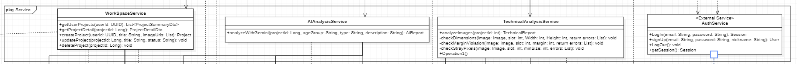

역할에 따라 4가지로 구분하였습니다.
Controller에서 갈라져 나온 WorkSpaceService, AIAnalysisService, TechnicalAnalysisSerivce가 있으며, 추가로 AuthService가 있습니다. AuthService는 자체적인 내부 로직 대신 외부 데이터베이스의 인증 서비스와 연동하여, 사용자 로그인 및 세션을 수행할 예정입니다. AnalysisController에서 AIAnalysisService, TechnicalAnalysisService로 구분함으로서 모듈 간의 응집도를 높였습니다.

#### 2.3.1 WorkSpaceService Description

| WorkSpaceService | |
| :--- | :--- |
| **Class Description** | 사용자의 작업 공간 및 프로젝트 데이터와 관련된 실질적인 비즈니스 로직(조회, 생성, 수정, 삭제)을 수행하는 서비스 클래스 |

**Operation**

| 구분 | | | | | |
| :--- | :--- | :--- | :--- | :--- | :--- |
| **Name** | **Argument** | **Returns** | **Scope** | **Visibility** | |
| **Description** | | | | | |
| getUserProjects | userId: UUID | List\<ProjectSummaryDto\> | instance | public | |
| 특정 사용자의 전체 프로젝트 목록 조회 | | | | | |
| getProjectDetail | projectId: Long | ProjectDetailDto | instance | public | |
| 특정 프로젝트의 상세 데이터 조회 | | | | | |
| createProject | userId: UUID, title: String, imageUrls: List | Project | instance | public | |
| 새로운 프로젝트 데이터 생성 | | | | | |
| updateProject | projectId: Long, title: String, status: String | void | instance | public | |
| 기존 프로젝트의 정보(제목, 상태) 수정 | | | | | |
| deleteProject | projectId: Long | void | instance | public | |
| 특정 프로젝트 데이터 삭제 | | | | | |

#### 2.3.2 AiAnalysisService Description

| AiAnalysisService | |
| :--- | :--- |
| **Class Description** | 외부 AI api을 연동하여 이모티콘의 연령대, 컨셉 등을 분석하는 서비스 클래스 |

**Operation**

| 구분 | | | | | |
| :--- | :--- | :--- | :--- | :--- | :--- |
| **Name** | **Argument** | **Returns** | **Scope** | **Visibility** | |
| **Description** | | | | | |
| analyzeWithGemini | projectId: Long, ageGroup: String, type: String, description: String | AiReport | instance | public | |
| 폼 데이터를 바탕으로 AI 분석 수행 및 결과 리포트 생성 | | | | | |

#### 2.3.3 TechnicalAnalysisService Description

| TechnicalAnalysisService | |
| :--- | :--- |
| **Class Description** | 이모티콘 이미지의 규격, 여백, 잔여 픽셀 등 기술적인 분석을 하는 서비스 클래스 |

**Operation**

| 구분 | | | | | |
| :--- | :--- | :--- | :--- | :--- | :--- |
| **Name** | **Argument** | **Returns** | **Scope** | **Visibility** | |
| **Description** | | | | | |
| analyzeImages | projectId: int | TechnicalReport | instance | public | |
| 프로젝트 내 이미지들의 전체 기술 분석 프로세스 시작 | | | | | |
| checkDimensions | image: Image, slot: int, Width: int, Height: int, return errors: List | void | instance | private | |
| 개별 이미지의 해상도 및 규격 적합성 검사 | | | | | |
| checkMarginViolation | image: Image, slot: int, margin: int, return errors: List | void | instance | private | |
| 개별 이미지의 테두리 여백 침범 검사 | | | | | |
| checkStrayPixels | image: Image, slot: int, minSize: int, errors: List | void | instance | private | |
| 투명 배경 내 불필요한 잔여 픽셀 검사 | | | | | |

#### 2.3.4 AuthService Description

| class name | |
| :--- | :--- |
| **Class Description** | 외부 인증 서비스와 연동하여 사용자의 로그인, 회원가입 및 세션 관리를 담당하는 서비스 클래스 |

**Operation**

| 구분 | | | | | |
| :--- | :--- | :--- | :--- | :--- | :--- |
| **Name** | **Argument** | **Returns** | **Scope** | **Visibility** | |
| **Description** | | | | | |
| LogIn | email: String, password: String | Session | instance | public | |
| 사용자 이메일과 비밀번호를 검증하여 로그인 처리 | | | | | |
| signUp | email: String, password: String, nickname: String | User | instance | public | |
| 신규 사용자 정보로 회원 등록 | | | | | |
| LogOut | None | void | instance | public | |
| 현재 활성화된 사용자 세션 종료 및 로그아웃 처리 | | | | | |
| getSession | None | Session | instance | public | |
| 현재 로그인된 사용자의 세션 정보 조회 | | | | | |

---

### 2.4 Repository Class Diagram

본 다이어그램은 시스템의 데이터 저장을 담당하는 Repository 계층의 구조를 나타냅니다. Spring의 JPA 인터페이스 구조를 가정하며 설계했습니다. Service 계층의 요청을 받아 데이터베이스에 접근하여 데이터를 조회, 저장, 삭제하는 역할을 수행합니다.

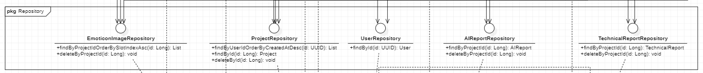

본 시스템의 도메인에 맞추어 5개의 Repository interface로 나누었습니다.
본 시스템 구현으로 채택한 프레임 워크의 Spring Boot의 JPA 메소드 네이밍 규칙을 적용하여, 별도의 SQL 작성 없이 메서드 이름만으로 정렬 및 조회가 가능하도록 설계하였습니다.

#### 2.4.1 EmoticonImageRepository Description

| EmoticonImageRepository | |
| :--- | :--- |
| **Class Description** | 이모티콘 개별 이미지에 대한 데이터베이스 접근을 담당하는 리포지토리 인터페이스 |

**Operation**

| 구분 | | | | | |
| :--- | :--- | :--- | :--- | :--- | :--- |
| **Name** | **Argument** | **Returns** | **Scope** | **Visibility** | |
| **Description** | | | | | |
| findByProjectIdOrderBySlotIndexAsc | id: Long | List | instance | public | |
| 특정 프로젝트에 속한 이미지들을 슬롯 번호 오름차순으로 정렬하여 조회 | | | | | |
| deleteByProjectId | id: Long | void | instance | public | |
| 특정 프로젝트에 속한 모든 이미지 데이터를 삭제 | | | | | |

#### 2.4.2 ProjectRepository Description

| ProjectRepository | |
| :--- | :--- |
| **Class Description** | 사용자의 프로젝트에 대한 데이터베이스 접근을 담당하는 리포지토리 인터페이스 |

**Operation**

| 구분 | | | | | |
| :--- | :--- | :--- | :--- | :--- | :--- |
| **Name** | **Argument** | **Returns** | **Scope** | **Visibility** | |
| **Description** | | | | | |
| findByUserIdOrderByCreatedAtDesc | id: UUID | List | instance | public | |
| 특정 사용자에 속한 프로젝트 목록을 최신 생성일 기준으로 내림차순 정렬하여 조회 | | | | | |
| findById | id: Long | Project | instance | public | |
| ID를 통해 특정 프로젝트의 상세 데이터를 단건 조회 | | | | | |
| deleteById | id: Long | void | instance | public | |
| ID를 통해 특정 프로젝트 데이터를 삭제 | | | | | |

#### 2.4.3 UserRepository Description

| class name | |
| :--- | :--- |
| **Class Description** | 사용자 계정에 대한 데이터베이스 접근을 담당하는 리포지토리 인터페이스 |

**Operation**

| 구분 | | | | | |
| :--- | :--- | :--- | :--- | :--- | :--- |
| **Name** | **Argument** | **Returns** | **Scope** | **Visibility** | |
| **Description** | | | | | |
| findById | id: UUID | User | instance | public | |
| ID를 통해 특정 사용자의 계정 정보를 조회 | | | | | |

#### 2.4.4 AiReportRepository Description

| class name | |
| :--- | :--- |
| **Class Description** | AI 분석 결과 리포트에 대한 데이터베이스 접근을 담당하는 리포지토리 인터페이스 |

**Operation**

| 구분 | | | | | |
| :--- | :--- | :--- | :--- | :--- | :--- |
| **Name** | **Argument** | **Returns** | **Scope** | **Visibility** | |
| **Description** | | | | | |
| findByProjectId | id: Long | AIReport | instance | public | |
| 특정 프로젝트에 매핑된 AI 분석 리포트 데이터를 조회 | | | | | |
| deleteByProjectId | id: Long | void | instance | public | |
| 특정 프로젝트에 매핑된 AI 분석 리포트 데이터를 삭제 | | | | | |

#### 2.4.5 TechnicalReportRepository Description

| TechnicalReportRepository | |
| :--- | :--- |
| **Class Description** | 기술 검수 결과 리포트에 대한 데이터베이스 접근을 담당하는 리포지토리 인터페이스 |

**Operation**

| 구분 | | | | | |
| :--- | :--- | :--- | :--- | :--- | :--- |
| **Name** | **Argument** | **Returns** | **Scope** | **Visibility** | |
| **Description** | | | | | |
| findByProjectId | id: Long | TechnicalReport | instance | public | |
| 특정 프로젝트에 매핑된 기술 검수 리포트 데이터를 조회 | | | | | |
| deleteByProjectId | id: Long | void | instance | public | |
| 특정 프로젝트에 매핑된 기술 검수 리포트 데이터를 삭제 | | | | | |

---

### 2.5 Dto Class Diagram

본 다이어그램은 계층 간 데이터 교환을 위해 사용되는 Dto 패키지의 구조를 나타냅니다.

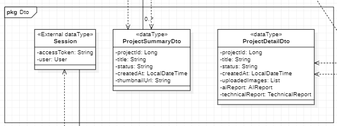

데이터베이스와 직접 연결된 엔티티를 프론트엔드로 직접 노출하는 것은 결합도 측면에서 좋지 않으므로, View에서 필요로 하는 데이터만을 선별하여 전달하기 위한 Dto를 도입했습니다.
이를 통해 백엔드의 내부 구현을 숨기고, 각 뷰의 요구사항에 최적화된 데이터만 전달합니다.

#### 2.5.1 Session Description

| class name | |
| :--- | :--- |
| **Class Description** | 외부 인증 서비스를 통해 발급받은 사용자의 접근 권한 토큰과 식별 정보를 담는 데이터 구조 |

**Attributes**

| 구분 | | | | |
| :--- | :--- | :--- | :--- | :--- |
| **Name** | **Type** | **Scope** | **Visibility** | |
| **Description** | | | | |
| accessToken | String | instance | private | |
| 세션 유지를 위한 보안 인증 토큰 값 | | | | |
| user | User | instance | private | |
| 현재 세션에 로그인된 사용자 객체 정보 | | | | |

#### 2.5.2 ProjectSummaryDto Description

| class name | |
| :--- | :--- |
| **Class Description** | 대시보드 화면 등에서 프로젝트 목록을 위해 필요한 정보만을 담아 전달하는 데이터 객체 |

**Attributes**

| 구분 | | | | |
| :--- | :--- | :--- | :--- | :--- |
| **Name** | **Type** | **Scope** | **Visibility** | |
| **Description** | | | | |
| projectId | Long | instance | private | |
| 프로젝트의 고유 식별자 | | | | |
| title | String | instance | private | |
| 프로젝트의 제목 | | | | |
| status | String | instance | private | |
| 프로젝트의 현재 진행 상태 | | | | |
| createdAt | LocalDateTime | instance | private | |
| 프로젝트가 최초로 생성된 일시 | | | | |
| thumbnailUrl | String | instance | private | |
| 리스트에서 보여줄 대표 썸네일 이미지의 경로 | | | | |

#### 2.5.3 ProjectDetailDto Description

| class name | |
| :--- | :--- |
| **Class Description** | 특정 프로젝트 작업 공간 진입 시, 업로드된 이미지 및 검수 리포트 등 전체 상세 데이터를 포함하여 전달하는 데이터 객체 |

**Attributes**

| 구분 | | | | |
| :--- | :--- | :--- | :--- | :--- |
| **Name** | **Type** | **Scope** | **Visibility** | |
| **Description** | | | | |
| projectId | Long | instance | private | |
| 프로젝트의 고유 식별자 | | | | |
| title | String | instance | private | |
| 프로젝트의 제목 | | | | |
| status | String | instance | private | |
| 프로젝트의 현재 진행 상태 | | | | |
| createdAt | LocalDateTime | instance | private | |
| 프로젝트가 최초로 생성된 일시 | | | | |
| uploadedImages | List | instance | private | |
| 프로젝트에 업로드된 전체 이미지의 목록 | | | | |
| aiReport | AIReport | instance | public | |
| 생성된 AI 분석 리포트 | | | | |
| technicalReport | TechnicalReport | instance | public | |
| 생성된 기술 검수 리포트 객체 | | | | |

---

### 2.6 Domain Class Diagram

본 다이어그램은 시스템의 핵심 데이터를 담는 Domain 계층의 구조를 나타냅니다.

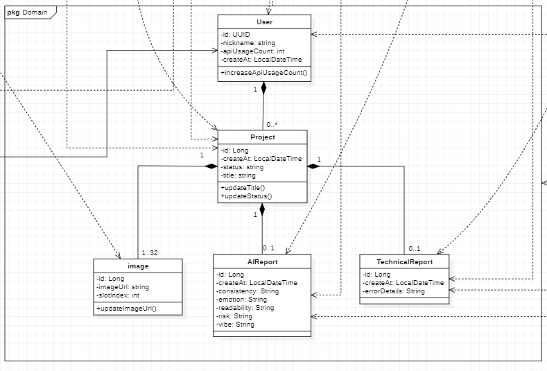

본 설계의 가장 큰 특징은 Project 엔티티를 중심으로 한 복합 관계입니다.
사용자는 여러 개의 프로젝트를 가질 수 있으며, 하나의 Project는 1~32개의 Image를 소유합니다.
또한, 하나의 Project는 각각 최대 1개의 AIReport와 TechnicalReport를 가집니다.
상위 객체인 프로젝트가 삭제될 때 그에 속한 이미지와 AIReport, TechnicalReport가 함께 소멸하여 생명주기가 같도록 하였습니다.

#### 2.6.1 User Description

| User | |
| :--- | :--- |
| **Class Description** | 서비스를 이용하는 회원의 계정 정보를 담고 있는 도메인 엔티티 |

**Attributes**

| 구분 | | | | |
| :--- | :--- | :--- | :--- | :--- |
| **Name** | **Type** | **Scope** | **Visibility** | |
| **Description** | | | | |
| id | UUID | instance | private | |
| 사용자 고유 식별자 | | | | |
| nickname | String | instance | private | |
| 사용자 화면에 표시될 닉네임 | | | | |
| apiUsageCount | int | instance | private | |
| 외부 AI API 호출 횟수 누적량 | | | | |
| createAt | LocalDateTime | instance | private | |
| 계정 생성 일시 | | | | |

**Operation**

| 구분 | | | | | |
| :--- | :--- | :--- | :--- | :--- | :--- |
| **Name** | **Argument** | **Returns** | **Scope** | **Visibility** | |
| **Description** | | | | | |
| increaseApiUsageCount | None | void | instance | public | |
| AI 분석 등을 수행할 때 API 사용 횟수를 1 증가시키는 로직 | | | | | |

#### 2.6.2 Project Description

| Project | |
| :--- | :--- |
| **Class Description** | 이모티콘 검수 작업의 단위가 되는 프로젝트의 핵심 데이터를 담고 있는 도메인 엔티티 |

**Attributes**

| 구분 | | | | |
| :--- | :--- | :--- | :--- | :--- |
| **Name** | **Type** | **Scope** | **Visibility** | |
| **Description** | | | | |
| id | Long | instance | private | |
| 프로젝트 고유 식별자 | | | | |
| createAt | LocalDateTime | instance | private | |
| 프로젝트 생성 일시 | | | | |
| status | String | instance | private | |
| 프로젝트의 현재 진행 상태 | | | | |
| title | String | instance | private | |
| 프로젝트 제목 | | | | |

**Operation**

| 구분 | | | | | |
| :--- | :--- | :--- | :--- | :--- | :--- |
| **Name** | **Argument** | **Returns** | **Scope** | **Visibility** | |
| **Description** | | | | | |
| updateTitle | None | void | instance | public | |
| 프로젝트의 제목을 변경하는 로직 | | | | | |
| updateStatus | None | void | instance | public | |
| 프로젝트의 진행 상태를 업데이트하는 로직 | | | | | |

#### 2.6.3 Image Description

| Image | |
| :--- | :--- |
| **Class Description** | 프로젝트에 업로드된 개별 이모티콘 이미지의 정보를 담고 있는 도메인 엔티티 |

**Attributes**

| 구분 | | | | |
| :--- | :--- | :--- | :--- | :--- |
| **Name** | **Type** | **Scope** | **Visibility** | |
| **Description** | | | | |
| id | Long | instance | private | |
| 이미지 고유 식별자 | | | | |
| imageUrl | String | instance | private | |
| 이미지가 실제로 저장된 스토리지 경로 | | | | |
| slotIndex | int | instance | private | |
| 전체 32칸 중 해당 이미지가 위치한 슬롯 번호 | | | | |

**Operation**

| 구분 | | | | | |
| :--- | :--- | :--- | :--- | :--- | :--- |
| **Name** | **Argument** | **Returns** | **Scope** | **Visibility** | |
| **Description** | | | | | |
| updateImageUrl | None | void | instance | public | |
| 이미지 재업로드 시 새로운 스토리지 경로로 업데이트하는 로직 | | | | | |

#### 2.6.4 AIReport Description

| AIReport | |
| :--- | :--- |
| **Class Description** | 외부 AI를 통해 분석된 이모티콘의 분석 결과를 저장하는 도메인 엔티티 |

**Attributes**

| 구분 | | | | |
| :--- | :--- | :--- | :--- | :--- |
| **Name** | **Type** | **Scope** | **Visibility** | |
| **Description** | | | | |
| id | Long | instance | private | |
| 리포트 고유 식별자 | | | | |
| createAt | LocalDateTime | instance | private | |
| 리포트 생성 일시 | | | | |
| consistency | String | instance | private | |
| 캐릭터 및 컨셉의 일관성 평가 결과 | | | | |
| emotion | String | instance | private | |
| 표현된 감정의 적절성 및 다양성 평가 결과 | | | | |
| readability | String | instance | private | |
| 이모티콘의 가독성 및 시인성 평가 결과 | | | | |
| risk | String | instance | public | |
| 저작권, 윤리 등 잠재적 위험 요소 평가 결과 | | | | |
| vibe | String | instance | public | |
| 이모티콘의 전반적인 분위기 및 느낌 | | | | |

#### 2.6.5 TechnicalReport Description

| TechnicalReport | |
| :--- | :--- |
| **Class Description** | 여백, 규격 등 시스템 내부에서 수행한 기술 검수 결과를 저장하는 도메인 엔티티 |

**Attributes**

| 구분 | | | | |
| :--- | :--- | :--- | :--- | :--- |
| **Name** | **Type** | **Scope** | **Visibility** | |
| **Description** | | | | |
| id | Long | instance | private | |
| 리포트 고유 식별자 | | | | |
| createAt | LocalDateTime | instance | private | |
| 리포트 생성 일시 | | | | |
| errorDetails | String | instance | private | |
| 검수 중 발견된 에러들의 상세 정보(JSON 형태) | | | | |

---

## 3. Sequence diagram

본 챕터에서는 시퀀스 다이어그램을 활용하여 핵심 Use Case들을 사용할 때의 시스템의 흐름을 나타내는 냅니다.

### 3.1 Join

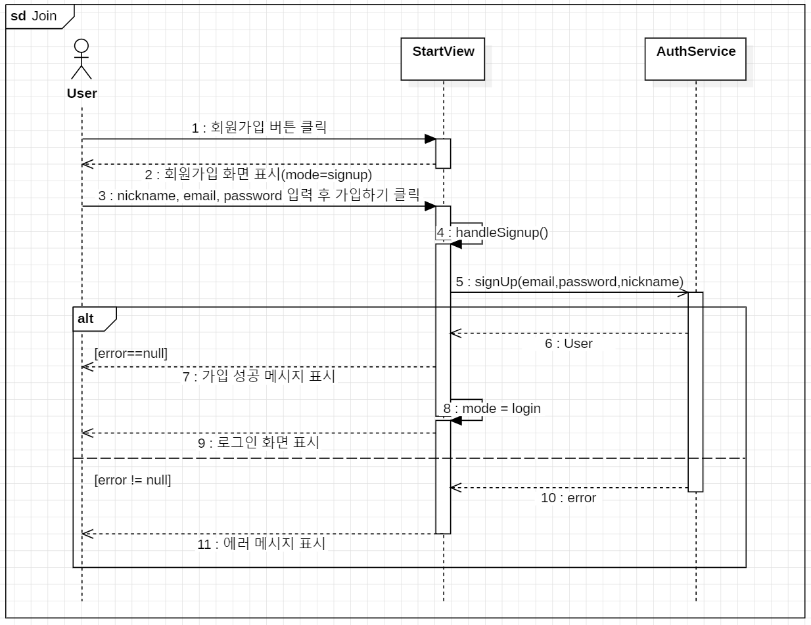

1. 사용자 화면 진입 및 정보 입력
   - 사용자가 StartView에서 회원가입 버튼을 클릭하면, 회원가입 화면을 렌더링합니다.
   - 사용자가 닉네임, 이메일, 비밀번호를 입력한 뒤 가입하기 버튼을 누르면, handleSignup() 메서드가 실행되어 입력된 데이터를 취합합니다.

2. 인증 서비스 호출
   - StartView는 사용자로부터 입력받은 정보(email, password, nickname)를 인자로 담아, AuthService로 signUp 메서드를 호출합니다. 이를 통해 실제 데이터베이스에 계정 생성을 요청합니다.

3. 결과 분기 및 UI 처리 (alt 블록)
   - **가입 성공 시:**
     - AuthService가 계정 생성을 성공적으로 마치고, 생성된 User 객체를 반환합니다.
     - 화면에는 가입 성공 메시지가 출력되며, 사용자에게 즉시 로그인 화면을 렌더링합니다.
   - **가입 실패 시:**
     - 이메일 중복 등 특정 이유로 인해 AuthService가 error를 반환합니다.
     - 화면에 해당 에러 메시지를 표시하여 사용자가 입력한 정보를 다시 수정할 수 있도록 유도합니다.

---

### 3.2 Login

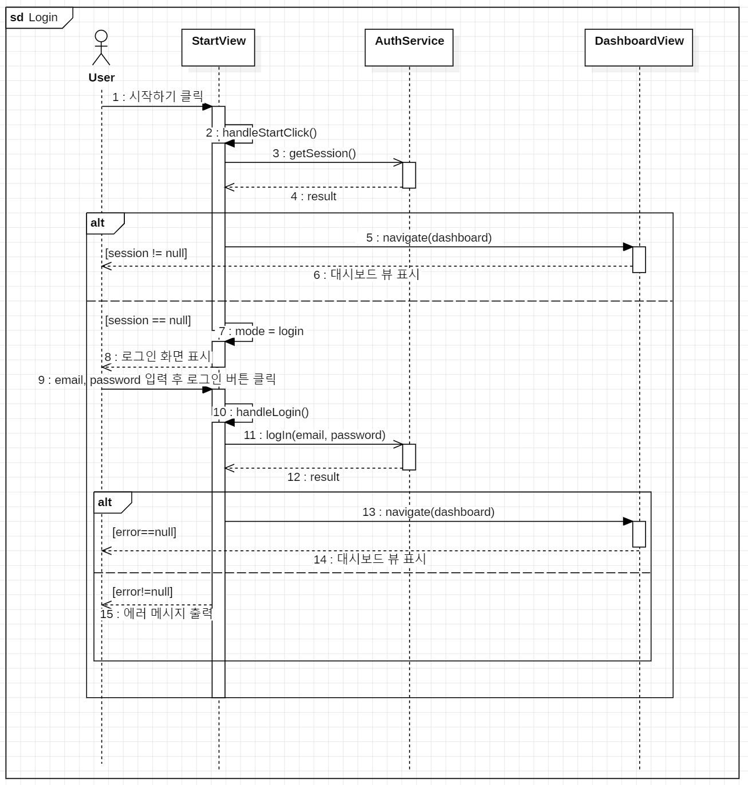

1. 앱 시작 및 세션 확인
   - 사용자가 StartView에서 시작하기 버튼을 클릭하면, handleStartClick() 메서드가 실행됩니다.
   - StartView는 AuthService로 getSession() 메서드를 호출하여 세션을 확인합니다.

2. 세션 유무에 따른 분기 (첫 번째 alt 블록)
   - **세션 존재 시:**
     - DashboardView로 navigate(dashboard)를 호출하여 대시보드 화면을 렌더링합니다.
   - **세션 부재 시:**
     - StartView를 로그인 모드(mode = login)로 설정하고 로그인 화면을 렌더링합니다.

3. 로그인 요청 및 결과 분기 (두 번째 alt 블록)
   - 사용자가 이메일, 비밀번호를 입력 후 로그인 버튼을 누르면 handleLogin() 메서드가 실행됩니다.
   - StartView는 AuthService로 logIn(email, password) 메서드를 호출하여 인증을 요청합니다.
   - **로그인 성공 시 ([error == null]):**
     - DashboardView로 navigate(dashboard)를 호출하여 대시보드 화면을 렌더링합니다.
   - **로그인 실패 시 ([error != null]):**
     - 화면에 에러 메시지를 출력하여 재입력을 유도합니다.

---

### 3.3 Logout

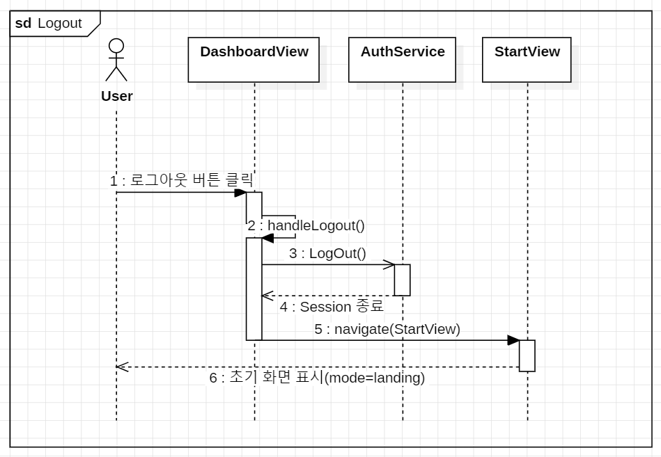

1. 로그아웃 요청
   - 사용자가 DashboardView에서 로그아웃 버튼을 클릭하면 handleLogout() 메서드가 실행됩니다.
   - DashboardView는 AuthService로 LogOut() 메서드를 호출하여 세션 종료를 요청합니다.

2. 세션 종료 및 화면 전환
   - AuthService가 세션 종료 처리를 완료하고 DashboardView로 결과를 반환합니다.
   - DashboardView는 StartView로 navigate(StartView)를 호출합니다.
   - 사용자에게 초기 화면(mode=landing)을 렌더링합니다.

---

### 3.4 Upload Image Set

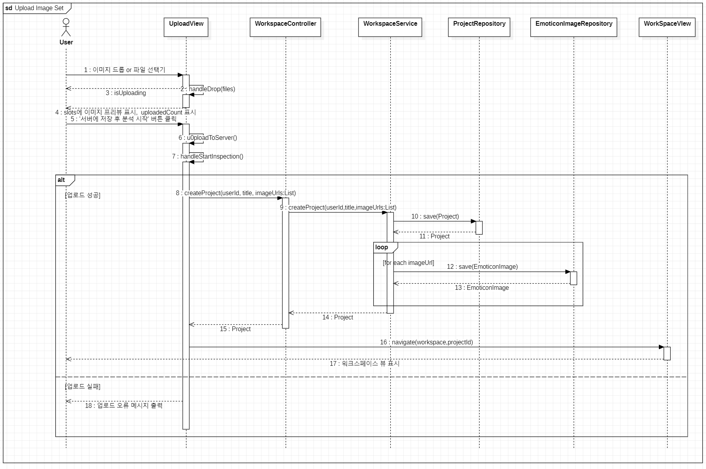

1. 이미지 파일 등록
   - 사용자가 UploadView에 이미지를 드롭하거나 파일을 선택하면 handleDrop(files) 메서드가 실행됩니다.
   - 화면에 이미지 프리뷰와 업로드된 파일 개수(uploadedCount)를 표시합니다.

2. 서버 저장 요청
   - 사용자가 '서버에 저장 후 분석 시작' 버튼을 클릭하면 uploadToServer() 및 handleStartInspection() 메서드가 실행됩니다.
   - UploadView는 WorkspaceController로 createProject()를 호출하여 프로젝트 생성을 요청합니다.

3. 저장 결과 분기 (alt 블록)
   - **업로드 성공 시:**
     - WorkspaceService는 ProjectRepository를 통해 프로젝트를 저장(save)합니다.
     - 전달받은 이미지 개수만큼 반복(loop)하여 EmoticonImageRepository에 개별 이미지를 저장합니다.
     - 모든 저장이 완료되면 View는 navigate(workspace, projectId)를 호출하여 워크스페이스 화면을 표시합니다.
   - **업로드 실패 시:**
     - 화면에 업로드 오류 메시지를 출력합니다.

---

### 3.5 Re-upload Modified Image

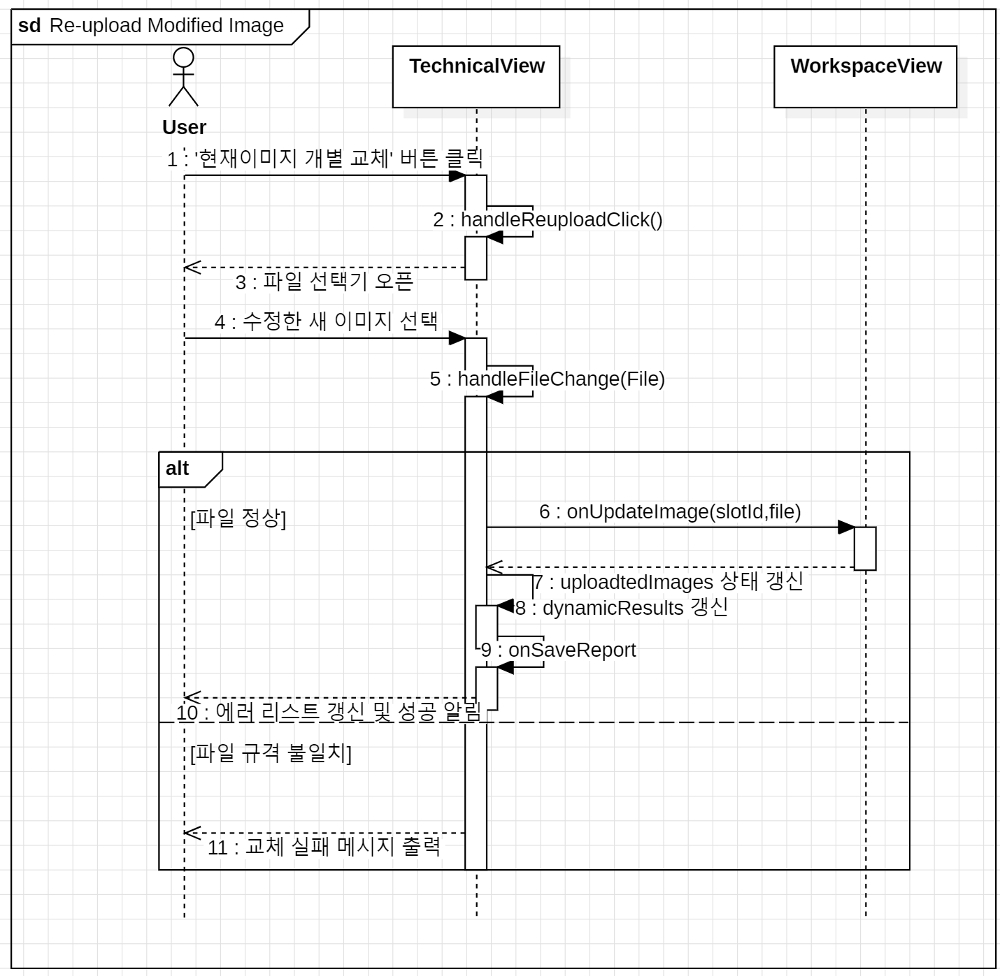

1. 이미지 교체 요청 및 파일 선택
   - 사용자가 TechnicalView에서 '현재이미지 개별 교체' 버튼을 클릭하면 handleReuploadClick() 메서드가 실행됩니다.
   - 파일 선택기를 통해 사용자가 수정한 새 이미지를 선택하면 handleFileChange(File) 메서드가 실행됩니다.

2. 파일 검증 및 결과 분기 (alt 블록)
   - **파일 정상 시:**
     - TechnicalView는 WorkspaceView로 onUpdateImage(slotId, file)를 호출하여 개별 이미지를 업데이트합니다.
     - 내부적으로 uploadedImages 상태와 dynamicResults를 차례로 갱신합니다.
     - onSaveReport()를 실행한 뒤, 에러 리스트를 갱신하고 사용자에게 성공 알림을 표시합니다.
   - **파일 규격 불일치 시:**
     - 화면에 교체 실패 메시지를 출력합니다.

---

### 3.6 Request Technical Analysis

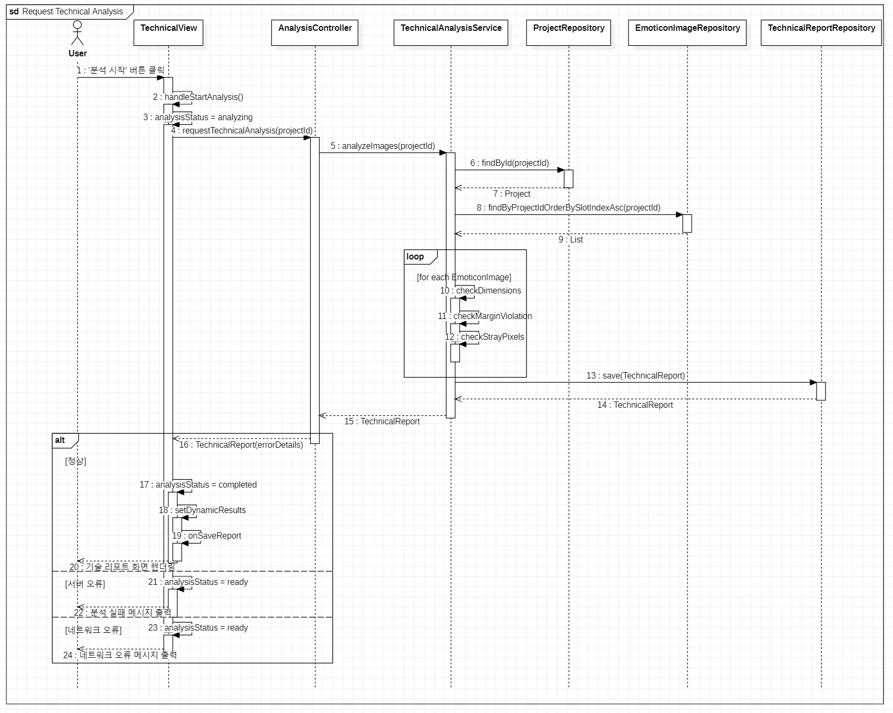

1. 분석 시작 요청 및 상태 변경
   - 사용자가 TechnicalView에서 '분석 시작' 버튼을 클릭하면 handleStartAnalysis()가 실행됩니다.
   - 내부 상태를 분석 중(analysisStatus = analyzing)으로 변경하고 AnalysisController로 requestTechnicalAnalysis(projectId)를 호출합니다.

2. 데이터베이스 조회 및 이미지 검수 (loop 블록)
   - Controller는 TechnicalAnalysisService로 analyzeImages(projectId)를 호출합니다.
   - Service는 Repository를 통해 Project와 EmoticonImage 목록을 차례대로 조회합니다.
   - 조회된 각 이미지에 대해 반복문(loop)을 돌며 규격(checkDimensions), 여백(checkMarginViolation), 픽셀 찌꺼기(checkStrayPixels)를 검사하고 그 결과를 DB에 저장(save)합니다.

3. 검수 결과 반환 및 화면 분기 (alt 블록)
   - 검수가 완료된 TechnicalReport 객체가 View까지 반환됩니다.
   - **정상 완료 시:**
     - 상태를 완료(completed)로 변경하고 결과값(setDynamicResults)을 업데이트한 뒤 기술 리포트 화면을 렌더링합니다.
   - **서버 오류 시:**
     - 상태를 대기(ready)로 되돌리고 분석 실패 메시지를 출력합니다.
   - **네트워크 오류 시:**
     - 상태를 대기(ready)로 되돌리고 네트워크 오류 메시지를 출력합니다.

---

### 3.7 Request AI Analysis

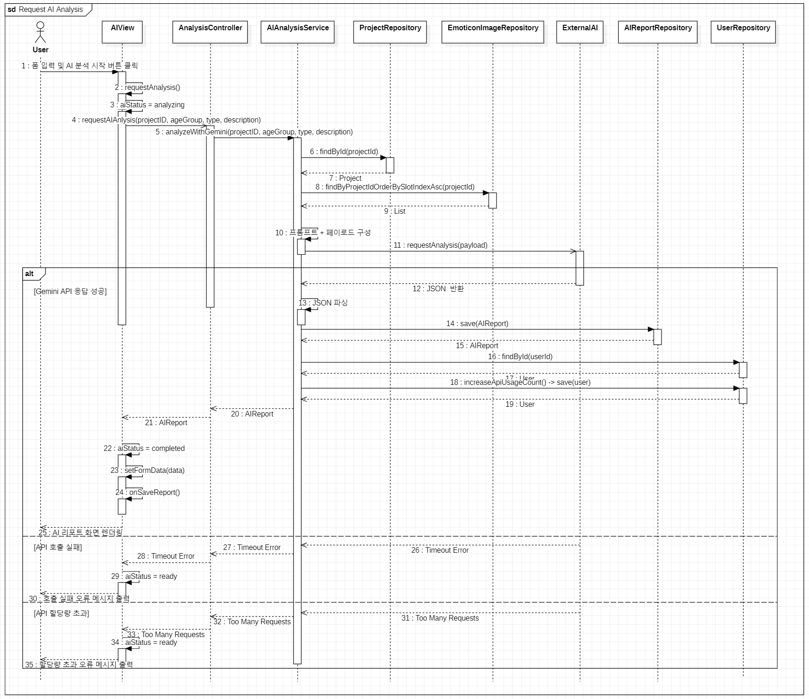

1. 분석 시작 요청 및 데이터 조회
   - 사용자가 AIView에서 폼을 입력하고 분석 시작 버튼을 클릭하면 requestAnalysis()가 실행됩니다.
   - 내부 상태를 분석 중(aiStatus = analyzing)으로 변경하고 AnalysisController로 requestAIAnalysis()를 호출합니다.
   - Controller는 AIAnalysisService의 analyzeWithGemini()를 호출하고, Service는 Repository를 통해 Project와 이미지 목록을 차례로 조회합니다.

2. 프롬프트 구성 및 외부 통신
   - AIAnalysisService는 조회된 데이터를 바탕으로 내부에서 프롬프트와 페이로드를 구성합니다.
   - ExternalAI 시스템으로 requestAnalysis(payload)를 호출하여 외부 API 서버와 통신합니다.

3. API 응답 결과 분기 (alt 블록)
   - **Gemini API 응답 성공 시 ([Gemini API 응답 성공]):**
     - 반환된 JSON 데이터를 파싱하여 AIReportRepository에 저장(save)합니다.
     - UserRepository를 호출하여 사용자의 API 호출 횟수를 증가시키고 DB에 갱신합니다.
     - 최종 AIReport가 View로 반환되면, 상태를 완료(completed)로 변경하고 데이터를 세팅한 뒤 AI 리포트 화면을 렌더링합니다.
   - **API 호출 실패 시:**
     - Timeout Error가 반환되면 상태를 대기(ready)로 되돌리고 호출 실패 오류 메시지를 출력합니다.
   - **API 할당량 초과 시:**
     - Too Many Requests 에러가 반환되면 상태를 대기(ready)로 되돌리고 할당량 초과 오류 메시지를 출력합니다.

---

### 3.8 View Detailed Technical Report

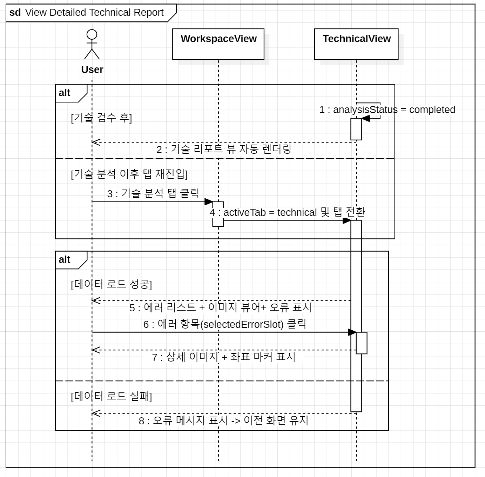

1. 기술 분석 탭 진입 및 렌더링 (첫 번째 alt 블록)
   - **기술 검수 직후 시:**
     - TechnicalView의 내부 상태가 완료(analysisStatus = completed)로 변경됩니다.
     - 사용자에게 기술 리포트 화면을 자동으로 렌더링하여 표시합니다.
   - **다른 탭에서 재진입 시:**
     - 사용자가 WorkspaceView에서 기술 분석 탭을 클릭합니다.
     - 상태를 변경(activeTab = technical)하고 TechnicalView로 화면을 전환합니다.

2. 데이터 로드 결과 및 상세 뷰어 동작 (두 번째 alt 블록)
   - **데이터 로드 성공 시:**
     - 화면에 에러 리스트, 이미지 뷰어, 오류 내용이 표시됩니다.
     - 사용자가 특정 에러 항목(selectedErrorSlot)을 클릭하면 해당하는 상세 이미지와 오류 좌표 마커가 렌더링됩니다.
   - **데이터 로드 실패 시:**
     - 화면에 오류 메시지를 출력하고 이전 화면 상태를 유지합니다.

---

### 3.9 View Detailed AI Report

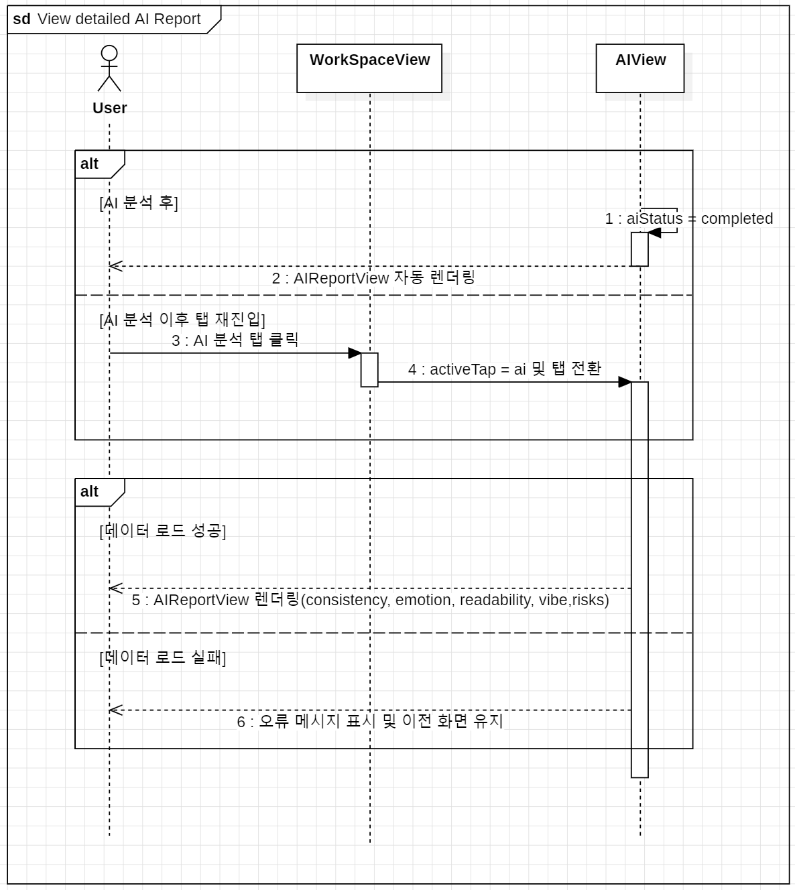

1. AI 분석 탭 진입 및 화면 렌더링 (첫 번째 alt 블록)
   - **AI 분석 직후 시:**
     - AIView의 내부 상태가 완료(aiStatus = completed)로 변경됩니다.
     - 사용자에게 AIReportView를 자동으로 렌더링하여 표시합니다.
   - **다른 탭에서 재진입 시:**
     - 사용자가 WorkspaceView에서 AI 분석 탭을 클릭합니다.
     - 상태를 변경(activeTab = ai)하고 AIView로 탭을 전환합니다.

2. 데이터 로드 결과 분기 (두 번째 alt 블록)
   - **데이터 로드 성공 시:**
     - 화면에 분석 결과(consistency, emotion, readability, vibe, risks)를 반영하여 AIReportView를 렌더링합니다.
   - **데이터 로드 실패 시:**
     - 화면에 오류 메시지를 출력하고 이전 화면 상태를 유지합니다.

---

### 3.10 View Personal Dashboard

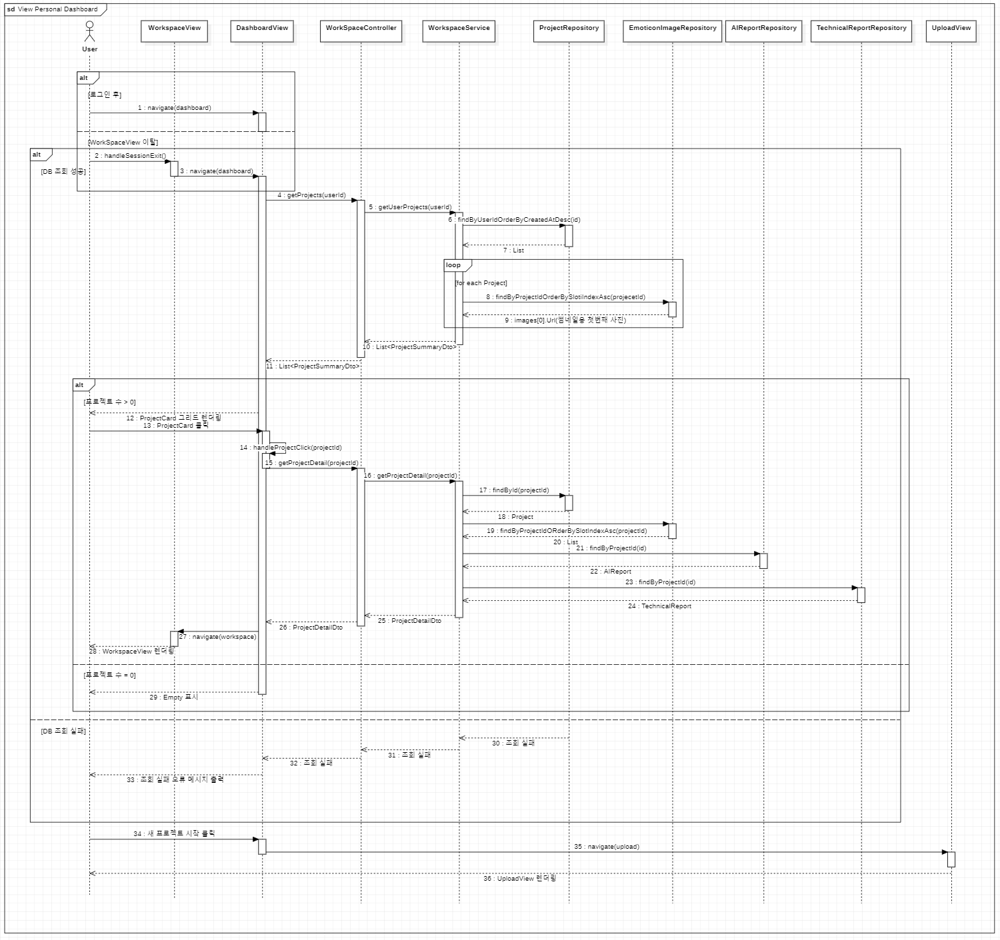

1. 대시보드 진입 및 데이터 조회 (첫 번째 alt 블록)
   - **로그인 직후 또는 작업 공간 이탈 시:**
     - 로그인을 완료하거나 WorkspaceView에서 이탈(handleSessionExit)할 경우 navigate(dashboard)를 호출하여 DashboardView로 진입합니다.
     - DashboardView는 WorkspaceController로 getProjects(userId)를 호출하여 사용자의 프로젝트 목록을 요청합니다.

2. 데이터베이스 조회 (두 번째 alt 블록)
   - **조회 성공 시:**
     - WorkspaceService는 ProjectRepository에서 프로젝트 목록을 생성일 역순으로 조회합니다.
     - 조회된 각 프로젝트에 대해 반복문(loop)을 돌며 EmoticonImageRepository에서 첫 번째 이미지(썸네일용)를 가져와 List\<ProjectSummaryDto\>를 반환합니다.
     - **(내부 alt) 프로젝트가 존재할 시 ([프로젝트 수 > 0]):**
       - 화면에 프로젝트 카드 그리드를 렌더링합니다.
       - 사용자가 특정 카드를 클릭(handleProjectClick)하면 getProjectDetail()을 호출하여 관련 Repository들로부터 상세 데이터를 모두 조회합니다.
       - 데이터 로드 후 navigate(workspace)를 호출하여 WorkspaceView를 렌더링합니다.
     - **(내부 alt) 프로젝트가 없을 시 ([프로젝트 수 = 0]):**
       - 화면에 빈 상태(Empty)를 표시합니다.
   - **조회 실패 시:**
     - 화면에 데이터베이스 조회 실패 오류 메시지를 출력합니다.

3. 프로젝트 생성
   - **새 프로젝트 시작 클릭 시:**
     - 사용자가 대시보드에서 '새 프로젝트 시작'을 클릭하면 navigate(upload)를 호출하여 UploadView를 렌더링합니다.

---

### 3.11 Simulate Emoticon on Chat UI

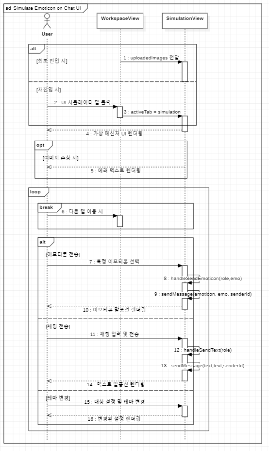

1. 시뮬레이터 진입 및 렌더링 (첫 번째 alt 블록)
   - **최초 진입 시 ([최초 진입 시]):**
     - WorkspaceView가 SimulationView로 업로드된 이미지(uploadedImages)를 전달합니다.
   - **재진입 시 ([재진입 시]):**
     - 사용자가 UI 시뮬레이터 탭을 클릭하여 상태를 변경(activeTab = simulation)합니다.
     - 진입 과정이 완료되면 SimulationView는 가상 메신저 UI를 렌더링합니다.

2. 데이터 검증 (opt 블록)
   - **이미지 손상 시 ([이미지 손상 시]):**
     - 전달받은 파일에 문제가 있을 경우 에러 텍스트를 우선 렌더링합니다.

3. 가상 메신저 UI 상호작용 (loop 및 두 번째 alt 블록)
   - 사용자가 다른 탭으로 이동(break)하여 루프를 탈출하기 전까지 메신저 UI 내부에서 반복 동작을 수행합니다.
   - **이모티콘 전송:**
     - 특정 이모티콘을 선택하면 내부 함수(handleSendEmoticon, sendMessage)가 실행되어 이모티콘 말풍선을 렌더링합니다.
   - **채팅 전송:**
     - 텍스트를 입력 및 전송하면 내부 함수(handleSendText, sendMessage)가 실행되어 텍스트 말풍선을 렌더링합니다.
   - **테마 변경:**
     - 대상 설정 및 테마를 변경하면 변경된 UI 설정을 즉시 렌더링합니다.

---

### 3.12 Reset Current Workspace

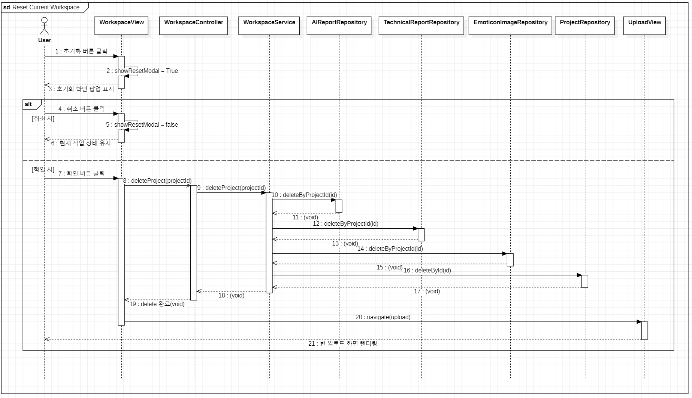

1. 초기화 요청 및 팝업 표시
   - 사용자가 WorkspaceView에서 초기화 버튼을 클릭합니다.
   - 내부 상태(showResetModal = True)를 변경하여 사용자에게 초기화 확인 팝업을 표시합니다.

2. 사용자 선택에 따른 분기 (alt 블록)
   - **취소 시:**
     - 사용자가 취소 버튼을 클릭하면 내부 상태(showResetModal = false)를 변경합니다.
     - 초기화를 중단하고 현재 작업 상태를 유지하여 화면에 표시합니다.
   - **확인 시:**
     - 사용자가 확인 버튼을 클릭하면 WorkspaceView가 WorkspaceController로 deleteProject(projectId)를 호출합니다.

3. 데이터베이스 삭제 및 화면 전환
   - Controller는 WorkspaceService로 삭제를 요청합니다.
   - Service는 AIReportRepository, TechnicalReportRepository, EmoticonImageRepository, ProjectRepository를 순차적으로 호출하여 해당 프로젝트와 연관된 모든 데이터를 DB에서 삭제(delete)합니다.
   - 삭제 완료 응답(void)이 View까지 반환되면 navigate(upload)를 호출합니다.
   - UploadView로 전환되어 사용자에게 빈 업로드 화면을 렌더링합니다.

---

## 4. State Machine Diagram
Client side(Front)와 System side(Back)두 가지로 나누어 설명하겠습니다.

### 4.1 Client Application State Machine Diagram

**1. 초기 인증 및 메인 대시보드 흐름**
- **StartView:** 시스템의 최초 진입점으로 로그인 및 회원가입 UI를 렌더링합니다. 회원가입 성공 시 로그인 탭으로 전환되며, 로그인 성공 시 DashboardView로 이동합니다.
- **DashboardView:** 진입 시 getUserProjects 메소드를 호출하여 프로젝트 목록을 로드합니다. 조회 실패 시 에러 알림 후 대시보드 상태를 유지합니다. 로그아웃 클릭 시 세션을 초기화하고 StartView로 복귀하며, '새 프로젝트 시작' 클릭 시 UploadView, 기존 프로젝트 클릭 시 WorkspaceView로 이동합니다.

**2. 이미지 업로드 흐름**
- **UploadView:** 진입 시 32개 슬롯 그리드를 렌더링합니다. 사용자가 이미지를 업로드 및 업로드 버튼 클릭 후 서버 저장에 성공하면 WorkspaceView로 이동하고, 실패 시 에러 알림과 함께 UploadView 상태를 유지합니다.

**3. 작업 공간 내부 복합 상태 흐름 (WorkspaceView)**
- **WorkspaceView:** 프로젝트 상세 조회를 수행하는 복합 상태입니다. 진입 후 데이터 로드에 실패하면 에러 알림 후 즉시 DashboardView로 복귀합니다. 내부에서 탭 간 이동 시 이전 작업 상태(로딩 상태 및 조회 데이터)를 초기화 없이 그대로 유지함을 히스토리 상태로 정의하였습니다. 
  - **SimulationView:** 워크스페이스 진입 시 최초 렌더링되는 상태로, 메신저 테마 설정을 로드하고 채팅 UI 시뮬레이션을 수행합니다.
  - **TechnicalView:** 기술 검수를 처리하는 복합 상태입니다. 초기 안내 상태(TechReady)에서 분석을 시작하면 로딩 상태(TechAnalyzing)로 진입하여 백엔드 응답을 대기합니다. 분석 성공 시 결과 화면인 TechCompleted로 전환되며, 통신 에러 발생 시 TechReady로 복귀하여 재시도를 유도합니다.
  - **AIView:** AI 분석을 처리하는 복합 상태입니다. 폼 입력 상태(AIReady)에서 분석을 요청하면 로딩 상태(AIAnalyzing)로 진입하여 외부 Gemini API의 응답을 대기합니다. 응답 수신 성공 시 AI 리포트 화면인 AICompleted로 전환되며, 할당량 초과 및 에러 발생 시 AIReady로 복귀합니다.

**4. 이탈 흐름**
- 사용자가 WorkspaceView에서 뒤로가기(handleSessionExit)를 수행하면 안전하게 DashboardView 상태로 복귀하며 전체 생명주기가 마무리됩니다.

### 4.2 Server System State Machine Diagram

**1. 중앙 대기 및 라우팅 흐름**
- **Idle:** 서버 시스템은 상시 구동 상태로 API 요청이 들어올때까지 대기합니다. 클라이언트로부터 기능별 요청이 들어오면 이를 파싱하여 RequestProcessing 복합 상태로 진입합니다. 모든 비즈니스 로직의 정상 수행이나 예외 처리가 완료되면 항상 이 상태로 안전하게 복귀하여 다음 API 요청을 대기합니다.

**2. 요청 처리 복합 상태 흐름 (RequestProcessing)**
- **RequestProcessing:** 서버의 핵심 비즈니스 로직들을 하나로 캡슐화한 거대한 복합 상태입니다. 진입 시 라우터(Choice Node)를 통해 요청 엔드포인트에 따라 5개의 세부 상태로 분배됩니다. 각 작업이 성공적으로 마무리되어 종료 노드에 도달하면 밖으로 빠져나가 Idle 상태로 복귀하지만, 내부의 어느 상태에서든 에러가 발생하면 하던 작업을 즉시 중단하고 ErrorHandling 상태로 이탈합니다.
  - **Authenticating:** 로그인 요청 시 진입하며, 요청받은 메소드를 호출하여 DB 연산을 수행합니다. 인증 성공 시 세션을 발급하고 종료 노드로 이동합니다.
  - **ProjectManaging:** 프로젝트 CRUD 요청 시 진입하며, 파라미터를 파싱하고 해당 비즈니스 로직을 수행합니다. 수행 성공 시 요청 결과를 반환하며 종료 노드로 이동합니다.
  - **ImageUploading:** 이미지 업로드 요청 시 진입하며, 이미지 데이터들을 파싱하고 파일 스토리지에 개별 저장합니다. 업로드 성공 시 종료 노드로 이동합니다.
  - **TechnicalAnalyzing:** 기술 검수 요청 시 진입하며, DB에서 대상 이미지를 로드한 뒤 기술 분석 알고리즘을 수행하고 결과를 리포트로 저장합니다. 검수 성공 시 종료 노드로 이동합니다.

**3. 비동기 AI 분석 흐름**
- **AI Requesting:** AI 분석 요청 시 진입하며, 클라이언트가 보낸 FormData를 파싱하여 외부 API 전송 객체를 생성합니다.
- **AI_Waiting:** 외부 Gemini API로 분석 요청을 전송한 후, 타임아웃 타이머를 시작하고 백그라운드에서 API 응답을 대기(비동기)합니다.
- **AI_Saving:** 외부 API 응답을 성공적으로 수신하면 진입하며, JSON 응답을 파싱하여 AI Report를 생성하고 DB에 저장합니다. 분석 성공 시 종료 노드로 이동합니다.

**4. 예외 처리 및 이탈 흐름**
- **ErrorHandling:** RequestProcessing 내부에서 네트워크 장애, 타임아웃, 권한 없음, 데이터베이스 접근 에러 등의 예외가 발생할 경우 그룹 전이(Group Transition)를 통해 즉시 진입하는 에러 전담 상태입니다. 진입 시 에러를 Catch하고 원인을 분석하여 클라이언트에게 반환할 에러 메시지를 생성합니다. 예외 처리가 완료되면 적절한 상태 코드를 반환하며 다시 Idle 상태로 복귀하여 서버가 죽지 않고 생명주기를 이어가도록 마무리됩니다.

## 5. Implementation requirements

(1) Frontend
- Runtime Environment : Node.js v20.x
- Framework / Library : React v18.x 

(2) Backend
- Language / Platform : Java JDK 21 / Gradle
- Framework : Spring Boot v3.x
- Data Access :　Spring Data JPA

(3) Database
- Relational DB : PostgreSQL(Supabase)
- File Storage : Supabase Storage
- Authentication : Supabase Auth

(4) External API
- AI System: Google Gemini API (Gemini Pro)

## 6. Glossary
- View (뷰 계층): 클라이언트의 사용자 인터페이스(UI)를 구성하는 React 기반의 컴포넌트 계층이다. 화면 렌더링 및 사용자 입력 이벤트 처리를 전담한다.

- Controller (컨트롤러 계층): 클라이언트의 REST API 요청을 수신하여 엔드포인트를 식별하고, 비즈니스 계층으로 라우팅한 뒤 연산 결과를 DTO 형태로 클라이언트에 응답하는 인터페이스 계층이다.

- Service (서비스 계층): 시스템의 핵심 비즈니스 로직과 분석 알고리즘을 수행하는 도메인 연산 계층이다. 트랜잭션 관리를 전담하며, 외부 API 통신 및 기술 검수 로직을 제어한다.

- Repository (리포지토리 계층): Spring Data JPA를 기반으로 데이터베이스에 접근하여 객체의 CRUD(생성, 조회, 수정, 삭제) 연산을 수행하는 데이터 액세스 계층이다.

- DTO (Data Transfer Object): 계층 간 데이터 교환 시 시스템 결합도를 낮추기 위해 사용하는 데이터 객체이다. 엔티티(Entity)를 화면에 직접 노출하지 않고, 필요한 속성만 정제하여 전송하는 역할을 한다.

- Entity / Domain (엔티티 도메인 객체): 데이터베이스 테이블과 1:1로 매핑되어, 고유 식별자(ID)와 영속적인 생명주기를 가지는 핵심 비즈니스 데이터 모델이다.

- Gemini API: Google의 대형 언어 모델(LLM) API. 본 시스템에서는 이모티콘의 컨셉, 시인성, 윤리적 리스크 등을 정성적으로 평가하는 외부 AI 분석 엔진으로 활용된다.

- Sequence Diagram (시퀀스 다이어그램): 특정 유스케이스 내에서 객체 간의 상호작용과 메시지 호출 흐름을 시간 순서에 따라 시각화한 동적 모델링 다이어그램이다.

- State Machine Diagram (상태 머신 다이어그램): 컴포넌트나 시스템이 생명주기 동안 외부 이벤트에 의해 겪는 상태 변화와 전이(Transition) 규칙을 규정한 UML 다이어그램이다.

- History State (히스토리 상태, H): 복합 상태(Composite State) 이탈 후 재진입 시, 초기화되지 않고 마지막으로 활성화되었던 하위 상태를 기억하여 복원하는 상태 머신 모델링 기법이다.

## 7. References
[1] OSS Design 강의 자료(Lecture #6-#9)

[2] Meta. React Official Documentation. https://react.dev 

[3] Spring. Spring Boot Reference Guide. https://spring.io/projects/spring-boot 

[4] Google. Gemini API Docs. https://ai.google.dev 

[5] Supabase. Supabase Docs. https://supabase.com/docs
